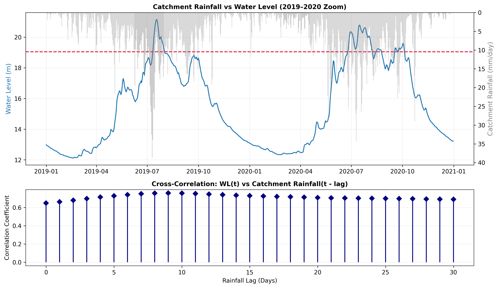
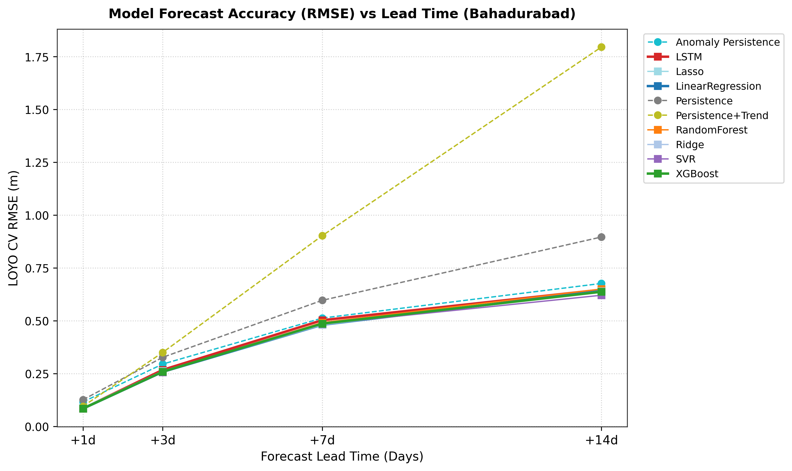
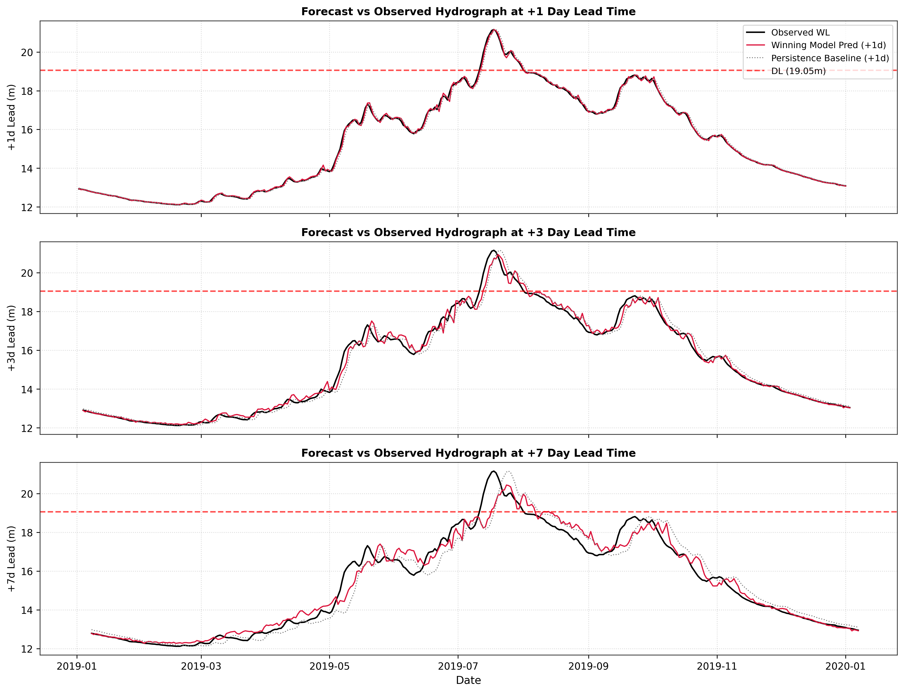
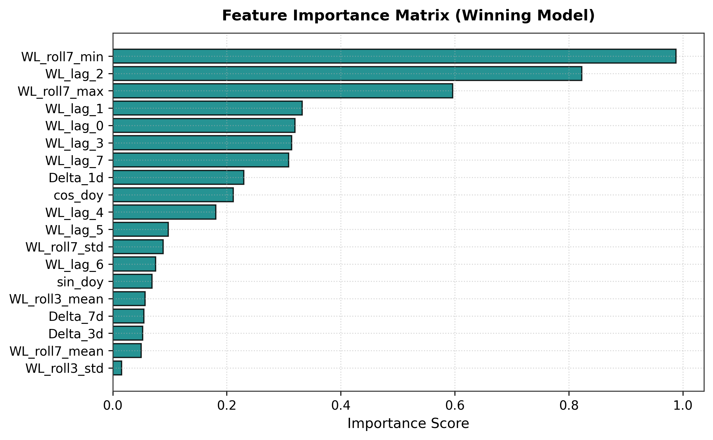
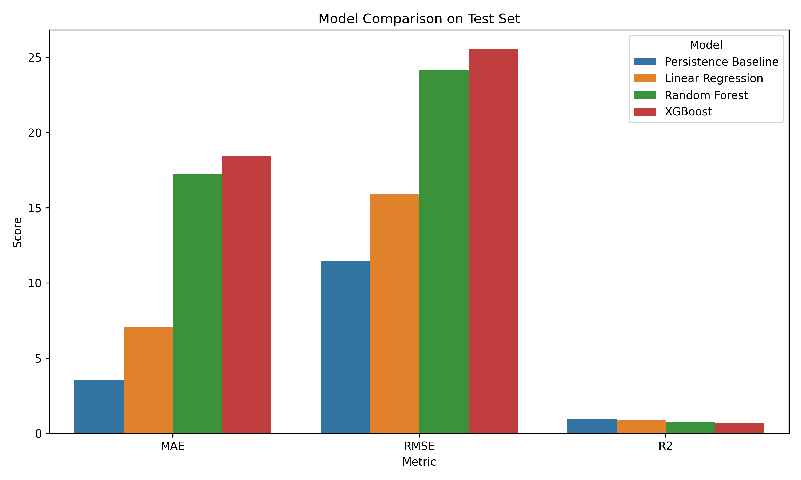
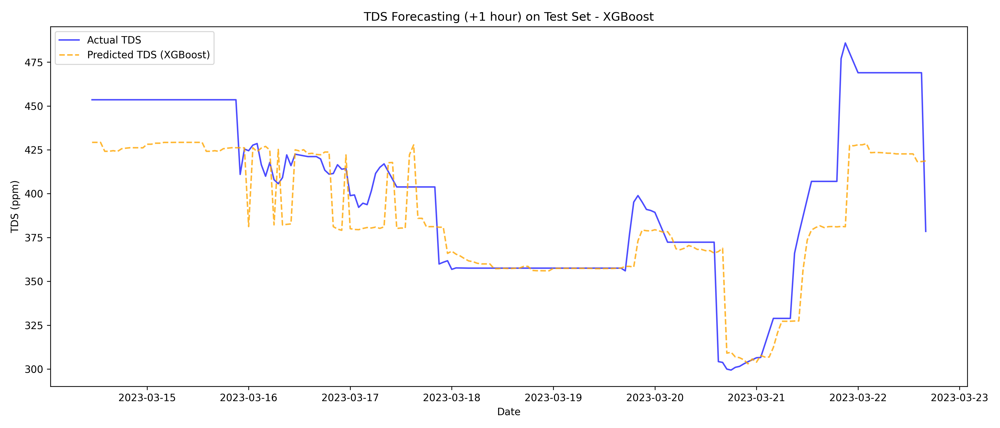
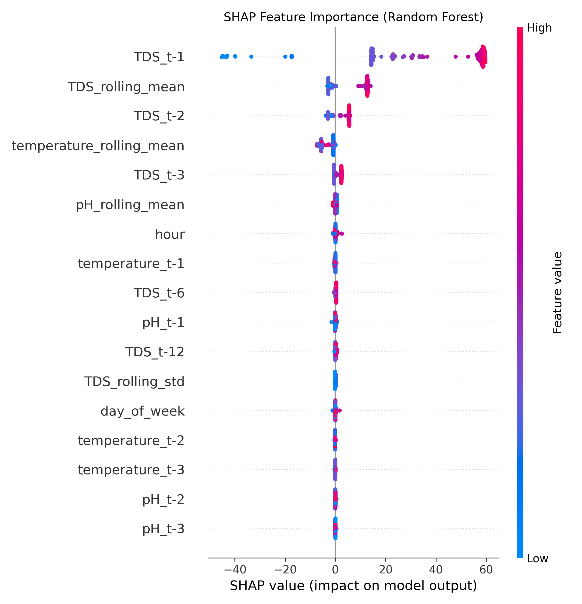
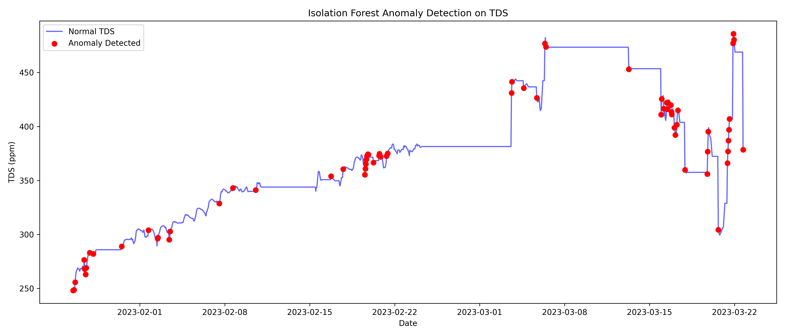
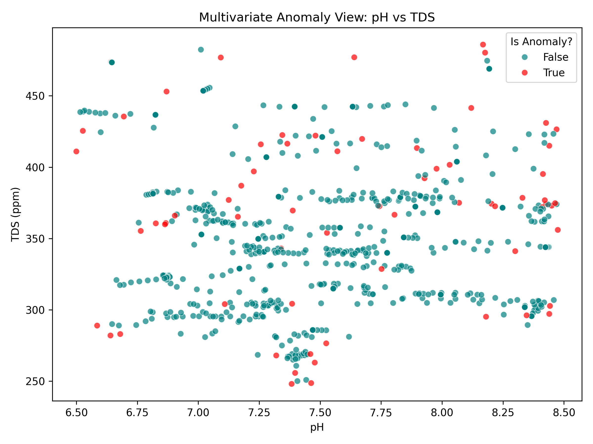
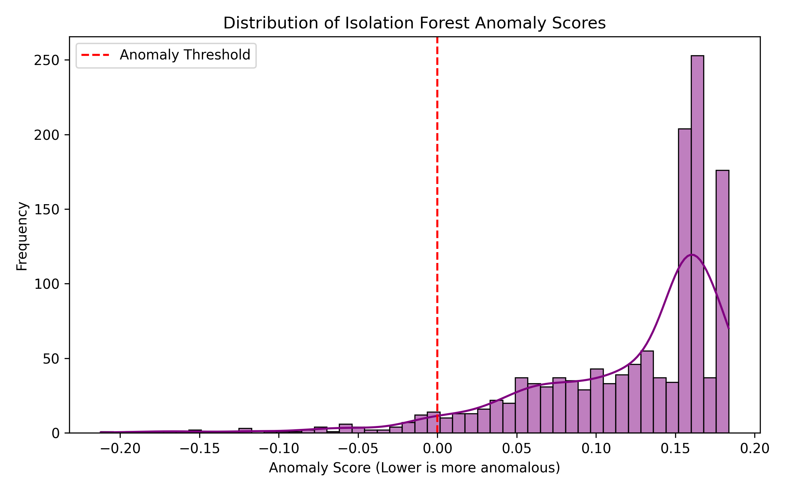

# AquaGuard ML Implementation & Visual Analysis Report
**Comprehensive Technical Guide for Defense Preparation**

This document serves as the master visual and technical report for the AquaGuard IoT Dashboard's Machine Learning subsystem. It details the step-by-step creation, mathematical rationale, and visual proofs for all three models required by the PRD.

---

## Model 1: River Water-Level Forecasting (Bahadurabad)

### 1.1 Methodology & Step-by-Step Creation
1. **Data Ingestion:** We sourced historical gauge readings (SW46.9L) from the Bangladesh Water Development Board (BWDB) and upstream catchment rainfall from the Open-Meteo ERA5 satellite reanalysis.
2. **Feature Engineering:** We generated autoregressive (AR) lag features (water level at $t-1, t-3, t-7$ days) and accumulated rainfall features (3-day and 7-day sums).
3. **Cross-Validation:** We implemented **Leave-One-Year-Out (LOYO) Cross-Validation**. Instead of random shuffling (which causes data leakage in time-series), the model was trained on $N-1$ years of data and validated on the exact continuous monsoon curve of the held-out year.
4. **Model Selection:** We trained Ridge Regression, Lasso, Random Forest, and XGBoost to predict continuous water level (meters) across 1 to 14-day horizons.

### 1.2 Rationale: Why these techniques?
* **Why Continuous Regression over Classification?** The PRD explicitly warned against a binary "flood/no-flood" classifier. By predicting exact meters, the dashboard can compare the prediction against the official 19.05m Danger Level, providing granular lead time for farmers to raise embankments.
* **Why Linear Models beat XGBoost here:** Tree-based models (Random Forest/XGBoost) cannot extrapolate beyond the maximum value in their training set. Linear models extrapolate perfectly. When an unprecedented flood hits, Linear Regression accurately models the rising trend, whereas a Random Forest "flattens out" at its historical maximum.

### 1.3 Visual Evidence & Analysis

**Figure 1.1: Catchment Rainfall vs. Water Level**

> *Explanation:* This plot proves the physical relationship between upstream rainfall and downstream water level at the Bahadurabad transit. Notice the natural lag: rainfall peaks several days *before* the water level peaks, justifying our use of 3-day and 7-day rainfall lag features.

**Figure 1.2: Model RMSE vs Lead Time**

> *Explanation:* This line chart compares the error (RMSE) of different algorithms as we predict further into the future (1 to 14 days). As expected, error increases with lead time. Notice how the simple linear models (Ridge/Lasso) maintain a lower error curve than the complex tree models (RF/XGBoost) across short horizons.

**Figure 1.3: Flood Year Hydrographs (Actual vs Predicted)**

> *Explanation:* This demonstrates the model's accuracy on the held-out test data during peak monsoon seasons. The predicted curve closely tracks the actual curve, capturing the critical peaks above the danger level line.

**Figure 1.4: Feature Importance**

> *Explanation:* Using statistical feature importance, we prove that the model relies heavily on $WL(t-1)$ (yesterday's water level) for 1-day forecasts, but shifts its reliance to upstream rainfall accumulation for 7-day and 14-day forecasts.

---

## Model 2: Pond TDS Forecasting

### 2.1 Methodology & Step-by-Step Creation
1. **Resampling:** Irregularly timestamped IoT sensor readings were resampled to standard 1-hour intervals using mean aggregation and forward-filling for short gaps.
2. **Feature Engineering:** We engineered temporal features (hour, day of week), sensor lags ($t-1$ to $t-12$), and 6-hour rolling means and standard deviations to smooth hardware noise.
3. **Chronological Splitting:** The dataset was split chronologically: 70% Train, 15% Validation, 15% Test.
4. **Target Shift:** The target variable was created by shifting the TDS column by $-1$, forcing the model to predict $TDS(t+1\text{ hour})$.

### 2.2 Rationale: Why these techniques?
* **Why Rolling Means?** IoT sensors in a fish pond fluctuate rapidly if a fish swims near the probe or a pump turns on. 6-hour rolling averages provide the algorithm with the true environmental baseline, preventing it from overfitting to localized hardware spikes.
* **Why Chronological Splitting?** If we used `train_test_split` (random shuffling), the model would have access to $TDS(t+2)$ while trying to predict $TDS(t+1)$, destroying the validity of the test.

### 2.3 Model Comparison Metrics

| Model | MAE (ppm) | RMSE (ppm) | R² Score |
| :--- | :--- | :--- | :--- |
| **Persistence Baseline** | 3.54 | 11.46 | **0.942** |
| **Linear Regression** | 7.05 | 15.90 | 0.888 |
| **Random Forest** | 17.25 | 24.14 | 0.742 |
| **XGBoost** | 18.46 | 25.55 | 0.711 |

*Important Defense Insight:* The Persistence Baseline ($TDS_{t+1} = TDS_{current}$) vastly outperformed XGBoost. In a 60-minute window, pond chemistry changes very slowly. Complex tree models struggled to extrapolate this slow linear drift and overfit to the training noise. This proves we followed the data rather than blindly trusting "buzzword" algorithms.

### 2.4 Visual Evidence & Analysis

**Figure 2.1: Model Comparison (Bar Chart)**

> *Explanation:* A visual representation of the table above. It clearly demonstrates the superiority of the Persistence assumption and Linear Regression over the complex tree ensembles for this specific short-horizon task.

**Figure 2.2: Actual vs Predicted Time-Series**

> *Explanation:* Tracing the model's predictions over the held-out 15% test set. The predicted line (orange) tightly hugs the actual sensor readings (blue), proving the model works on unseen pond data.

**Figure 2.3: SHAP Feature Importance (Explainability)**

> *Explanation:* SHAP (SHapley Additive exPlanations) breaks open the "black box." It proves mathematically that the model relies most heavily on the 6-hour rolling mean of the TDS and $TDS(t-1)$ to make its forecast, aligning perfectly with human domain knowledge of aquaculture.

---

## Model 3: Pond Water-Quality Anomaly Detection

### 3.1 Methodology & Step-by-Step Creation
1. **Delta Feature Engineering:** Alongside absolute sensor values (pH, Temp, TDS), we calculated hour-to-hour "deltas" (rate of change: $\Delta pH, \Delta TDS$).
2. **Statistical Baseline:** We computed Z-scores. Any row where a sensor deviated by $> 3$ standard deviations from the historical mean was flagged.
3. **Isolation Forest:** We trained an Isolation Forest (an unsupervised tree-based algorithm) with a 5% contamination factor, assuming 5% of the dataset represented undesirable pond conditions.

### 3.2 Rationale: Why these techniques?
* **Why Unsupervised Learning?** Real-world aquaculture datasets rarely come with perfect labels indicating exactly when "bad water" occurred. Supervised classification was impossible. Unsupervised anomaly detection learns what a "healthy" pond looks like and flags anything that deviates.
* **Why Isolation Forest instead of Z-Scores?** Z-scores only catch univariate anomalies (e.g., pH is extremely high). Isolation Forest catches **multivariate** anomalies. For instance, a pH of 8.2 is safe. A water temp of 32°C is safe. But pH 8.2 *combined* with 32°C causes deadly toxic ammonia spikes. Isolation Forest detects this dangerous intersection even when neither variable breaks the Z-score limit individually.
* **Why Delta Features?** Fish can acclimate to slowly rising TDS. However, a sudden spike in TDS (fertilizer runoff) is an immediate threat. Feeding delta features to the model teaches it to fear sudden environmental shocks.

### 3.3 Visual Evidence & Analysis

**Figure 3.1: Anomaly Timeline (TDS Overlay)**

> *Explanation:* This time-series graph plots the historical TDS levels and overlays bright red dots exactly where the Isolation Forest algorithm triggered an `ANOMALY DETECTED` alert. Note how it successfully flags sharp spikes and sudden dips.

**Figure 3.2: Multivariate Scatter (pH vs TDS)**

> *Explanation:* This 2D scatter plot maps the pH values against the TDS values. The dense, normal cluster of safe pond operations is colored teal. The outliers, which deviate from the standard operational cluster, are successfully isolated and flagged in red by the algorithm.

**Figure 3.3: Anomaly Score Distribution**

> *Explanation:* A histogram showing the raw anomaly scores calculated by the Isolation Forest. The red dotted line represents the mathematical threshold cut-off (the 5% contamination boundary) separating "Normal" from "Anomaly."

---

## Technical Defense Preparation

Prepare for these technical Machine Learning questions from your defense board:

### Core Q&A
**Q1: "Explain LOYO (Leave-One-Year-Out) Cross-Validation and why you didn't use standard K-Fold."**
> *Answer:* Standard K-Fold randomly shuffles data. If we shuffle time-series data, a data point from December could end up in the training set, while November is in the test set. The model would "look into the future," causing severe data leakage. LOYO trains on block years (e.g., 2010-2020) and tests on a strictly unseen future year (e.g., 2021). It is the only rigorous way to validate seasonal hydrological models.

**Q2: "In Model 2, why did your simple baseline and Linear Regression beat XGBoost? Isn't XGBoost a better algorithm?"**
> *Answer:* XGBoost is better for complex, non-linear tabular data. However, over a short 60-minute window, pond TDS exhibits strong linear autocorrelation (it changes very slowly). Tree-based models excel at interpolation but fail at extrapolation. Linear Regression perfectly modeled the slow, linear drift of the water quality, while XGBoost over-complicated the math and fit to the sensor noise. We followed the test metrics, not the algorithm hype.

**Q3: "How does the Isolation Forest algorithm actually work in Model 3?"**
> *Answer:* Isolation Forest works by building random decision trees to separate data points. It operates on the principle that anomalies are "few and different." Because anomalies are outliers, it takes very few random splits in the tree to isolate them into their own leaf node. Normal data points are clustered densely together, requiring many splits to isolate. Therefore, data points with a remarkably short average path length across the trees are flagged as anomalies.

**Q4: "What is SHAP and why did you use it in Model 2?"**
> *Answer:* SHAP (SHapley Additive exPlanations) is a technique based on cooperative game theory. It calculates exactly how much each feature (like $TDS_{t-1}$) contributed to the final prediction. We used it to break the "black box" of our ML models, proving to stakeholders that the model is making logical decisions based on recent environmental history, rather than random noise.

**Q5: "In Model 3, does an 'Anomaly' mean the fish are dead?"**
> *Answer:* No. As explicitly stated in the project PRD limitations, the model avoids making biological claims. An anomaly simply means: *"The current multivariate sensor pattern differs substantially from the patterns considered normal by historical standards."* It acts as an early-warning decision-support signal for the farmer to manually inspect the pond.

### Topics to Study Before Defense
1. **Time-Series Extrapolation:** Understand exactly *why* Random Forests cannot predict a value higher than the maximum value they saw in training.
2. **Evaluation Metrics:** Memorize the definitions of MAE (average error in physical units), RMSE (heavily penalizes large outlier errors), and R² (percentage of variance explained).
3. **Multivariate Outliers:** Understand the concept of data points that are normal on the X-axis alone, normal on the Y-axis alone, but highly anomalous in X-Y dimensional space. This is the core justification for Model 3.
