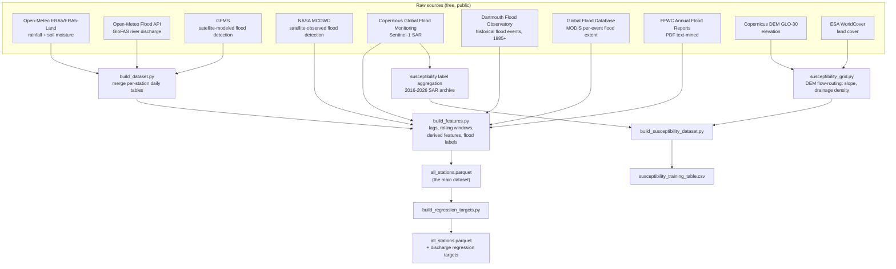

# Bangladesh Flood Forecasting Dataset

A ready-to-use, engineered dataset for flood forecasting and susceptibility modeling at 30 river-gauge
locations across Bangladesh, built entirely from **free, public** satellite, weather, and river data —
no paid data sources, no registration-gated data behind a paywall.

This folder is **fully self-contained** — the ready-made data files are included directly, and the full
ingestion + feature-engineering pipeline that produced them is included too, so you can either use the
data as-is or regenerate/extend it from scratch.

This guide assumes you are **not** using Claude Code or any AI assistant — every step is a plain command
you type yourself.

---

## What's in this folder

| Path | What it is |
|---|---|
| `data/features/2026-08-07c/all_stations.parquet` | **The main dataset** — 839,340 rows x 49 columns, daily time series per station, 30 stations, 1950–2026 |
| `data/features/2026-08-07c-discharge-regression/all_stations.parquet` | Same dataset + 3 extra forward-shifted discharge columns (`discharge_target_24h/48h/72h`), for regression-style modeling |
| `data/susceptibility/susceptibility_training_table.csv` | A separate, spatial (not time-series) dataset — 1,381 grid points (~49 per station), static terrain/land-cover features + flood label |
| `train/stations.py` | The 30 stations: ID, name, river, basin, lat/lon — the single source of truth every script below reads from |
| `train/ingest_*.py` | 10 scripts, one per raw data source (see below) |
| `train/build_dataset.py`, `train/build_features.py` | Merge the raw sources into per-station daily tables, then engineer lags/rolling windows/derived features |
| `train/build_regression_targets.py` | Adds the forward-shifted discharge regression targets |
| `train/build_susceptibility_dataset.py`, `train/susceptibility_grid.py`, `train/snap_discharge_grid.py` | Build the spatial susceptibility grid dataset |
| `train/crosscheck_distance_to_river.py`, `train/crossvalidate_gfms_mcdwd.py` | Data-quality cross-checks between independent sources (see `assets/`) |
| `requirements.txt` | Everything needed to run the pipeline |
| `.env.example` | Template for the 2 optional credentials (NASA Earthdata, Google Earth Engine) needed only if you re-run specific ingestion scripts |

---

## How this dataset was built



<p align="center">
  <br>
  <sub><i>All 30 monitored stations, plotted by real coordinates — spans all 4 major basins (Ganges,
  Brahmaputra/Jamuna, Surma/Meghna, and the southeastern coastal/hill rivers).</i></sub>
</p>

### Data sources, in detail

| Source | What it provides | Access |
|---|---|---|
| Open-Meteo (ERA5/ERA5-Land reanalysis) | Daily rainfall + soil moisture, local point + upstream catchment | Free, no key |
| Open-Meteo Flood API (GloFAS v4 reanalysis) | Daily river discharge (m³/s) | Free, no key — used in place of BWDB's real gauge history, which is a paid product |
| GFMS (Global Flood Monitoring System) | Modeled daily flood detection, partial coverage 2013–2016 + 2021–2026 | Free, UMD-hosted |
| NASA MCDWD (MODIS/VIIRS Global Flood Product) | Satellite-*observed* flood detection, 2003–2025, cross-validates GFMS | Free, requires a NASA Earthdata login (registration only, no cost) |
| Copernicus Global Flood Monitoring (GFM) | Sentinel-1 SAR-observed flooding, 2016–2026 continuous | Free |
| Dartmouth Flood Observatory (DFO) | Historical flood event archive, extends labeled data back to 1985 | Free |
| Global Flood Database (GFD) | Per-pixel MODIS flood extent per event, via Google Earth Engine | Free, requires a Google Cloud project with Earth Engine enabled (registration only, no cost) |
| FFWC Annual Flood Reports | Bangladesh's official flood agency's PDF reports, text-mined for station-level flood confirmations | Free (public PDFs) |
| Copernicus DEM GLO-30 | 30m elevation, used to derive slope/drainage density via flow-routing | Free, no registration |
| ESA WorldCover | 10m global land-cover classification | Free, no registration |

Every source above is genuinely free — no BWDB paid historical data, no commercial weather API, nothing
requiring payment. Two sources need a free account registered (NASA Earthdata for MCDWD, Google Cloud +
Earth Engine for GFD) — see `.env.example`; both are optional if you're only using the ready-made parquet
files and not re-running those two specific ingestion scripts.

### Why multiple flood-label sources at all

No single free source has continuous, reliable daily flood-detection coverage for the full historical
window this dataset spans. Five independent sources (GFMS, MCDWD, Copernicus GFM, DFO, GFD) are combined
with a deliberately conservative rule: a day is only labeled "flooded" if at least one source positively
confirms it (OR-combination), and each source's positive-only signal is trusted more than its negatives
(most of these products are much better at confirming "yes, water was observed here" than at confirming
a true, cloud-free "no"). `crossvalidate_gfms_mcdwd.py` and `crosscheck_distance_to_river.py` are two
real cross-checks run between independent sources before trusting a design decision — not just assumed.

---

## The main dataset: `data/features/2026-08-07c/all_stations.parquet`

839,340 rows × 49 columns. One row per (station, date). Column groups:

- **Identity**: `date`, `station_id`, `station_name`
- **Raw daily values**: `rainfall_local_mm`, `rainfall_upstream_mm`, `soil_moisture_local`,
  `river_discharge_m3s`, `flood_byStor` (+ a `_missing` boolean flag for each, since satellite/reanalysis
  gaps are common and should be modeled explicitly, not silently imputed)
- **Lag features**: each raw value at t-1d/t-2d/t-3d/t-5d
- **Rolling/derived features**: 7d/14d rainfall sums, 7-vs-prior-7-day trend ratios, a 30-day soil
  moisture delta, a soil water index (`soil_moisture_swi`)
- **Static terrain**: `elevation_m`, `hand_m` (height above nearest drainage)
- **Upstream discharge**: `upstream_chain_discharge_lag1d/2d`, `upstream_reference_discharge_lag2d/3d` —
  discharge from upstream stations on the same river network, lagged by travel time
- **Labels**: `flood_within_24h`/`48h`/`72h` (0/1, forward-looking) + a `_label_regime` column per horizon
  recording which underlying source(s) confirmed that label (for filtering/auditing)

Date range: 1950–2026 (weather/discharge features are only meaningfully populated from roughly the
1990s onward, per the underlying reanalysis products' own coverage; flood labels are populated from 1985
onward via the DFO extension). 30 stations, all 4 major basins.

**The regression variant** (`data/features/2026-08-07c-discharge-regression/`) is the same 49 columns
plus `discharge_target_24h/48h/72h` — the actual future discharge value (not a 0/1 label) at each
horizon, for training a regressor instead of a classifier.

## The spatial dataset: `data/susceptibility/susceptibility_training_table.csv`

1,381 rows (a ~7x7, ~10km-radius grid around each of the 30 stations, minus a handful dropped for
insufficient observation depth) × 11 columns: `point_id`, `station_id`, `basin`, `lat`, `lon`,
`elevation_m`, `slope_deg`, `dist_to_river_m`, `drainage_density_km_per_km2`, `landcover_class`, and
`label` (1 = observed flooded at least once in the 2016–2026 Copernicus GFM archive, 0 = observed
clean 200+ times with zero detections — a deliberately strict bar for trusting a negative).

---

## Using the data as-is (no setup beyond pandas)

```python
import pandas as pd

df = pd.read_parquet("data/features/2026-08-07c/all_stations.parquet")
susceptibility = pd.read_csv("data/susceptibility/susceptibility_training_table.csv")
```

That's it — no other setup needed if you just want the data.

## Regenerating or extending the dataset from scratch

### Step 1: Python + a virtual environment

```
python -m venv .venv
```
Activate it (`.venv\Scripts\activate.bat` on Windows Command Prompt, `.venv\Scripts\Activate.ps1` on
PowerShell, `source .venv/bin/activate` on Mac/Linux), then:
```
pip install -r requirements.txt
```

### Step 2: (optional) credentials for 2 of the 10 sources

Copy `.env.example` to `.env` and fill in NASA Earthdata / Google Earth Engine credentials — only needed
if you're re-running `train/ingest_mcdwd.py` or `train/ingest_global_flood_db.py`. Every other ingestion
script needs no key at all.

### Step 3: run the ingestion scripts

Each `train/ingest_*.py` downloads its own source into `data_raw/<source>/`. Most support `--smoke-test`
to verify end-to-end on a tiny slice before committing to a full backfill (some of these, like MCDWD's
full range, can take hours). Run each script with `--help` for its exact options.

### Step 4: build the merged dataset

```
python train/build_dataset.py --version <your-version-tag>
python train/build_features.py --version <your-version-tag>
```

Output lands in `data/processed/<version>/` and `data/features/<version>/`.

### Step 5 (optional): regression targets / susceptibility grid

```
python train/build_regression_targets.py --version <your-version-tag>
python train/build_susceptibility_dataset.py
```

---

## Data-quality plots

<p align="center">
  <br>
  <sub><i>See above.</i></sub>
</p>

The two cross-check scripts (`train/crosscheck_distance_to_river.py`,
`train/crossvalidate_gfms_mcdwd.py`) each produce their own diagnostic figure when run — real empirical
checks between independent sources, not assumptions. Run them to regenerate.

---

## Troubleshooting

- **`ModuleNotFoundError`** — activate the virtual environment and run `pip install -r requirements.txt`
  first.
- **Geospatial packages (`rasterio`, `pysheds`, `geopandas`) fail to install** — these have binary
  dependencies (GDAL) that are occasionally tricky on Windows; installing via `conda`/`mamba` instead of
  plain `pip` is usually more reliable if you hit build errors.
- **`EARTHDATA_TOKEN not found`** — only relevant if you're running `ingest_mcdwd.py`; see Step 2 above.
- **A raw source is temporarily unreachable** — most `ingest_*.py` scripts are resumable; re-running
  picks up roughly where it left off rather than restarting from scratch.
