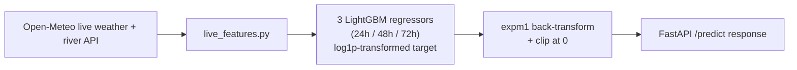
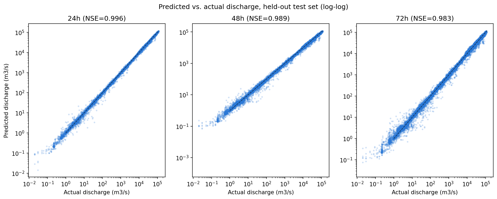
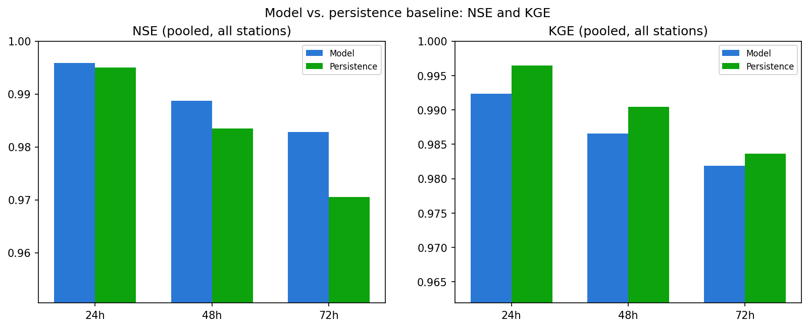
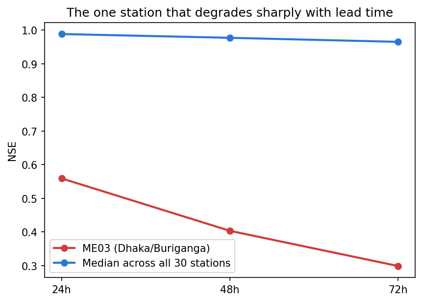
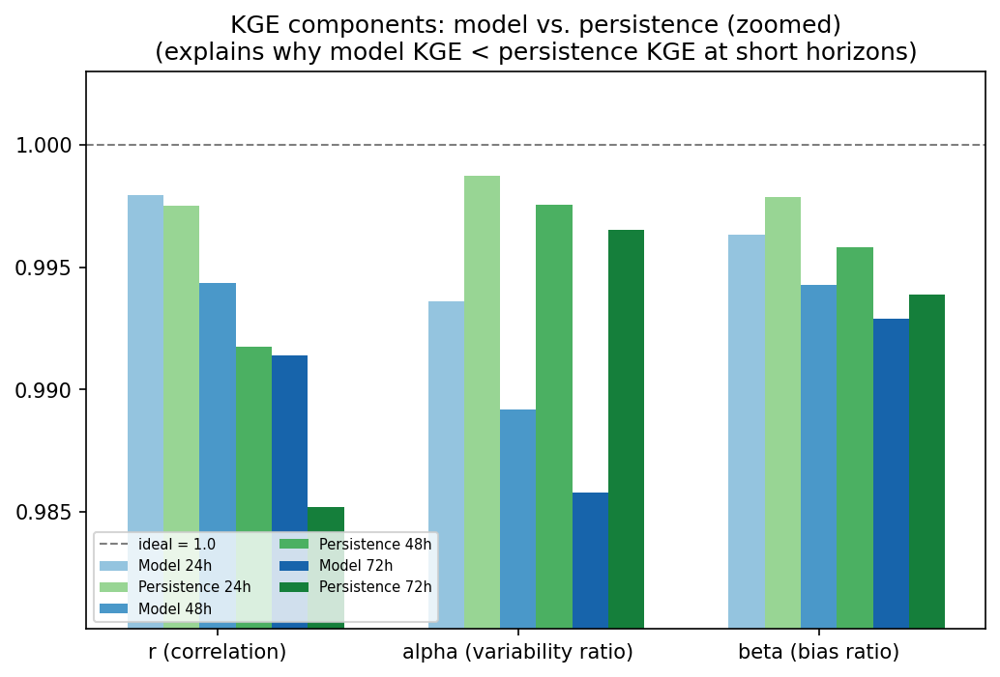

# River Discharge Forecaster

Predicts river discharge (how much water is flowing, in cubic meters per second) 24, 48, and 72 hours
ahead at any of 30 river monitoring stations across Bangladesh, using live rainfall, soil moisture, and
river discharge data.

This model predicts a **number** (flow rate), not a yes/no flood decision — see "What this model
actually tells you" below before using it.

This folder is **fully self-contained** — copy the whole folder to any computer with Python installed
and it will work, with no dependency on anything else.

This guide assumes you are **not** using Claude Code or any AI assistant — every step is a plain
command you type yourself.

---

## How it works



---

## What's in this folder

| File | What it does |
|---|---|
| `main.py` | The web server (FastAPI) — this is what you actually run |
| `discharge_model.py` | Loads the trained model and turns a prediction into a discharge forecast |
| `live_features.py` | Fetches today's real rainfall/soil moisture/river data and builds the model's input |
| `open_meteo.py` | Low-level client for the free weather/river-flow data source |
| `stations.py` | The list of 30 monitored stations and their coordinates |
| `feature_transforms.py` | The exact math that turns raw data into what the model expects |
| `schemas.py` | Defines the shape of the API's request/response data |
| `models/` | The actual trained model files (do not edit or move these) |
| `requirements.txt` | The list of Python packages this needs |

---

## What this model actually tells you (read this before using it)

This model predicts a **number**: how many cubic meters of water per second will likely be flowing
through a station's river in 24/48/72 hours. It does **not** know each station's official "danger
level" in that same unit (river gauges report danger levels in water height, meters — this model works
in flow rate, m³/s — the two aren't directly convertible without extra site-specific data this model
doesn't have).

**What it's good for:** telling you whether a river's flow is expected to rise, fall, or stay steady,
and by roughly how much, compared to today. Rivers range enormously in size (from ~2 m³/s on a small
stream to ~39,000 m³/s on the largest confluence in this dataset) — always compare the predicted number
to that same station's *own* typical range, never to another station's.

**What it's not**: a direct flood/no-flood alert.

---

## How this model was trained, and how it performs

Three independent LightGBM regressors (one per horizon: 24h/48h/72h), trained on the log1p-transformed
discharge target (given the ~5-orders-of-magnitude scale spread across stations, from small streams to
the largest river confluence), evaluated with `expm1` + clip-at-zero back-transform at inference.

| Horizon | R² / NSE | KGE | MAE (m³/s) | Improvement over "tomorrow = today" persistence |
|---|---|---|---|---|
| 24h | 0.996 | 0.992 | 321.2 | **+11.1%** |
| 48h | 0.989 | 0.987 | 534.2 | **+20.8%** |
| 72h | 0.983 | 0.982 | 672.2 | **+28.2%** |

**Why the persistence comparison is the headline number, not R²**: R² (0.98–0.996) looks impressive but
is substantially inflated by cross-station scale variance — a model that just outputs "about right for
this station's typical size" already scores well on R² without doing genuine forecasting. The
persistence-baseline comparison is the honest test, and its margin **grows** with horizon — the right
shape for a model that's adding real leading-indicator skill, not just echoing today's reading. (MAPE
is also computed but not treated as a headline number — it's distorted by a handful of near-zero-
discharge small rivers where any small absolute error becomes a huge percentage.)

<p align="center">
  <br>
  <sub><i>Predicted vs. actual discharge (log-log scale), all 3 horizons.</i></sub>
</p>

<p align="center">
  <br>
  <sub><i>NSE and KGE, model vs. persistence baseline, all 3 horizons.</i></sub>
</p>

<p align="center">
  <br>
  <sub><i>Per-station NSE, 24h horizon — one station (a small, flashy stream) sits well below the rest;
  see below.</i></sub>
</p>

<p align="center">
  <br>
  <sub><i>ME03 (Dhaka's Buriganga River — the smallest-discharge station in the network) vs. the network
  median, by horizon: NSE 0.56 at 24h, degrading to 0.30 by 72h, while every other station stays
  relatively stable with lead time. A real, honestly-reported weak point, not hidden.</i></sub>
</p>

<p align="center">
  <br>
  <sub><i>KGE's three components, model vs. persistence, all horizons. The model's correlation (r) is
  consistently higher (better) than persistence at every horizon; its variability ratio (alpha) is
  consistently lower — the model under-disperses relative to the true series' day-to-day swings (a
  well-understood regression characteristic: minimizing squared error smooths spikes that a "copy
  yesterday" persistence baseline never smooths). This is why the model's raw KGE sits very slightly
  below persistence's at 24h despite a real 11% MAE improvement — not a contradiction once
  decomposed.</i></sub>
</p>

---

## Part 1 — Running it on your own computer

### Step 1: Check you have Python

```
python --version
```

Need Python 3.10 or newer. Try `python3 --version` if `python` isn't found. Install from
[python.org](https://python.org) if neither works (on Windows, check "Add Python to PATH" during
install).

### Step 2: Open a terminal inside this folder

```
cd path/to/discharge-forecaster
```

### Step 3: Create a virtual environment

```
python -m venv .venv
```

Only needs to be done once.

### Step 4: Activate it

**Windows (Command Prompt):** `.venv\Scripts\activate.bat`
**Windows (PowerShell):** `.venv\Scripts\Activate.ps1`
**Mac/Linux:** `source .venv/bin/activate`

Your terminal prompt should now start with `(.venv)`. Repeat this step every time you open a new
terminal for this project.

### Step 5: Install requirements

```
pip install -r requirements.txt
```

### Step 6: Run the server

```
uvicorn main:app --reload --port 8001
```

Leave this running; `Ctrl+C` to stop.

### Step 7: Check it works

Open **http://127.0.0.1:8001/docs** in a browser, or:
```
curl "http://127.0.0.1:8001/predict?station_id=SW90"
```

---

## Part 2 — Understanding the API

### `GET /health`
Returns `{"status": "ok", "model_loaded": true}` if everything started correctly.

### `GET /stations`
Lists all 30 monitored stations (ID, name, river, coordinates).

### `GET /predict`
Call with **either** `station_id` (e.g. `?station_id=SW90`) or `lat`/`lon` (e.g.
`?lat=25.19&lon=89.66`, auto-snapped to the nearest station; only works inside Bangladesh).

**Example response:**
```json
{
  "station_id": "SW90",
  "station_name": "Bahadurabad",
  "station_distance_km": 0.0,
  "basin": "brahmaputra",
  "current_discharge_m3s": 36727.2,
  "forecasts": [
    {"horizon": "24h", "predicted_discharge_m3s": 35103.3, "trend": "steady"},
    {"horizon": "48h", "predicted_discharge_m3s": 33624.4, "trend": "falling"},
    {"horizon": "72h", "predicted_discharge_m3s": 32990.0, "trend": "falling"}
  ],
  "generated_at": "2026-08-10T12:00:00Z",
  "note": "This model predicts river discharge (m3/s), not a flood/no-flood decision...",
  "data_sources": { "...": "..." }
}
```

- `current_discharge_m3s` — today's actual live reading (`null` if the live data source was briefly
  unavailable — the model still returns a prediction in that case, just without a "today" number to
  compare against).
- `trend` — `"rising"` / `"falling"` / `"steady"` relative to `current_discharge_m3s` (more than ±5%
  counts as rising/falling).

### Errors
| Status | Meaning |
|---|---|
| `400` | Missing both `station_id` and `lat`/`lon`, or coordinates outside Bangladesh |
| `404` | Unknown `station_id` |
| `502` | The live weather data source was unreachable — try again shortly |
| `503` | The model failed to load on startup — check the terminal for errors |

---

## Part 3 — Calling it from a website

### Plain JavaScript

```html
<script>
async function getDischargeForecast(stationId) {
  const response = await fetch(`http://127.0.0.1:8001/predict?station_id=${stationId}`);
  if (!response.ok) {
    const err = await response.json();
    throw new Error(err.detail);
  }
  return await response.json();
}

getDischargeForecast('SW90').then(data => {
  console.log(data.current_discharge_m3s, data.forecasts);
});
</script>
```

### React example

```jsx
import { useEffect, useState } from 'react';

function DischargeForecast({ stationId }) {
  const [data, setData] = useState(null);

  useEffect(() => {
    fetch(`http://127.0.0.1:8001/predict?station_id=${stationId}`)
      .then(res => res.json())
      .then(setData);
  }, [stationId]);

  if (!data) return <p>Loading...</p>;
  return (
    <div>
      <h3>{data.station_name}</h3>
      <p>Current: {data.current_discharge_m3s ?? '(unavailable)'} m³/s</p>
      {data.forecasts.map(f => (
        <p key={f.horizon}>{f.horizon}: {f.predicted_discharge_m3s} m³/s ({f.trend})</p>
      ))}
    </div>
  );
}
```

### CORS

This server currently allows requests from any website (`allow_origins=["*"]` in `main.py`). Restrict
this to your own site's domain before deploying publicly.

---

## Part 4 — Deployment

The steps above work identically on any server with Python. For production, drop `--reload`, bind to
`0.0.0.0`, and lock down CORS. Point your website's `fetch()` calls at wherever the server actually runs
instead of `127.0.0.1`.

---

## Troubleshooting

- **`ModuleNotFoundError`** — activate the virtual environment (Step 4) and run `pip install -r
  requirements.txt` (Step 5) before running `uvicorn`.
- **`No model artifacts at .../models`** — you copied only the `.py` files and not the `models/` folder.
  Copy the whole `discharge-forecaster` folder.
- **Predictions take a few seconds** — normal; every request fetches fresh live data first.
- **`502` errors** — the free Open-Meteo API is temporarily unreachable; wait and retry.
- **Numbers look huge/tiny compared to what you expected** — remember discharge varies by ~5 orders of
  magnitude across stations (a small stream vs. the largest river confluence). Always compare a
  station's forecast to its own `current_discharge_m3s` and its own typical range, not to another
  station's numbers.
