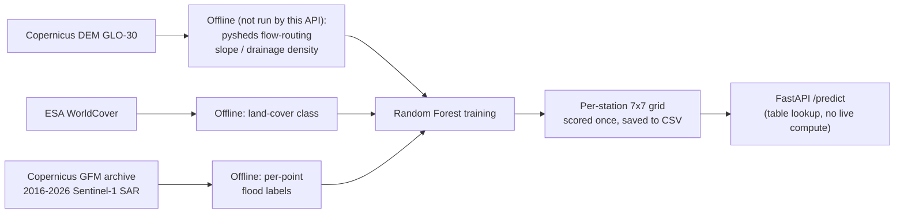
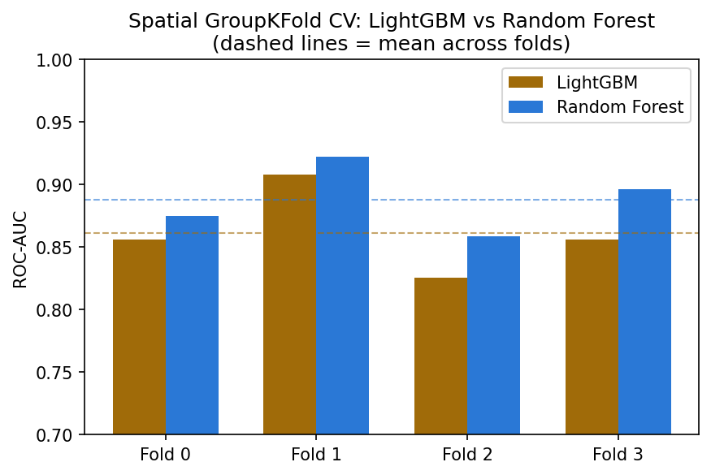
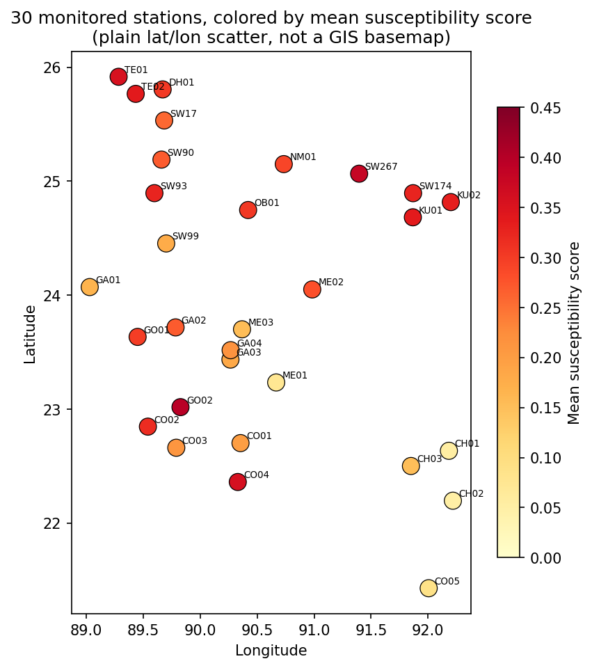
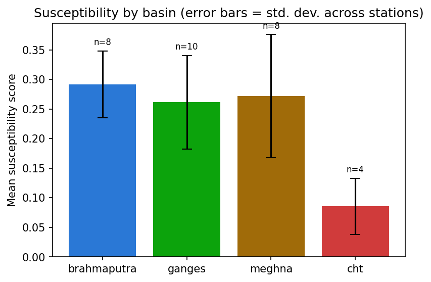
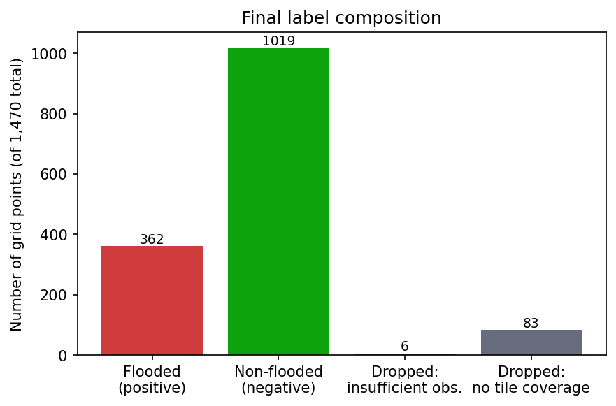
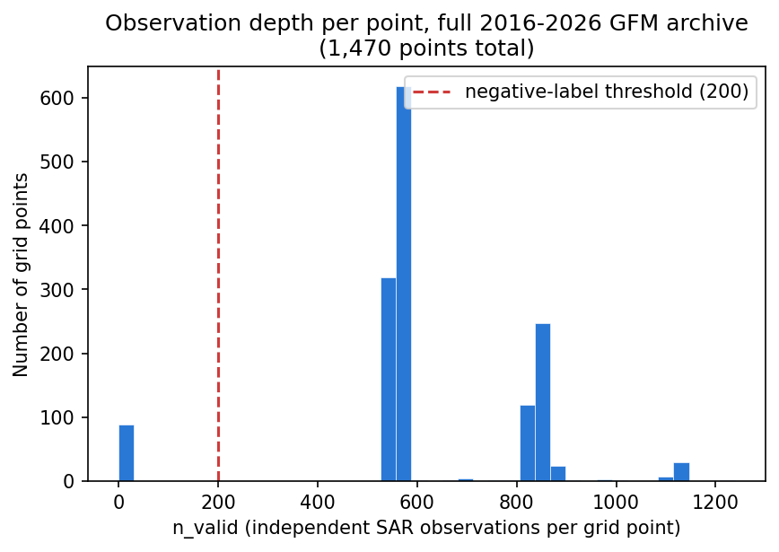
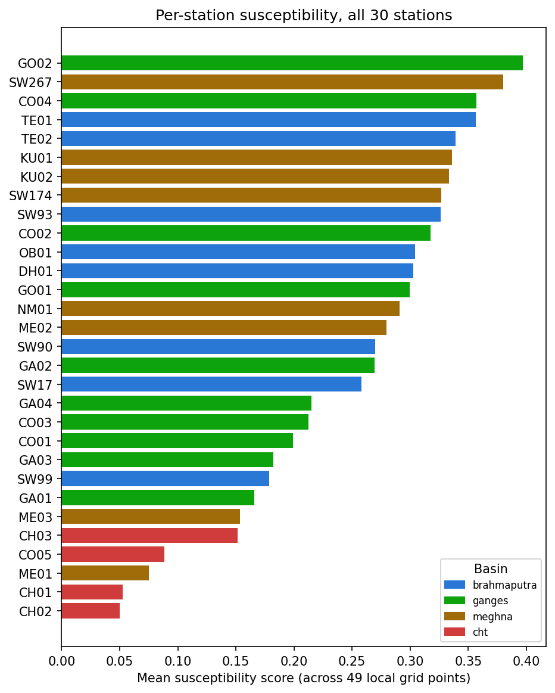
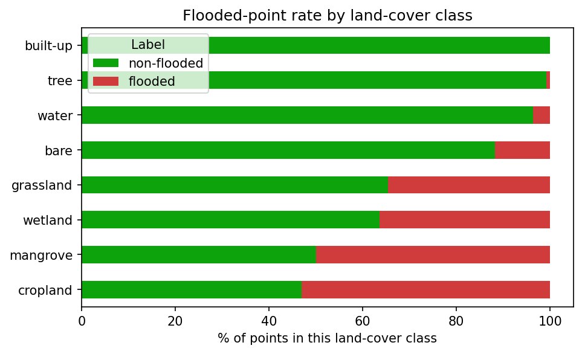
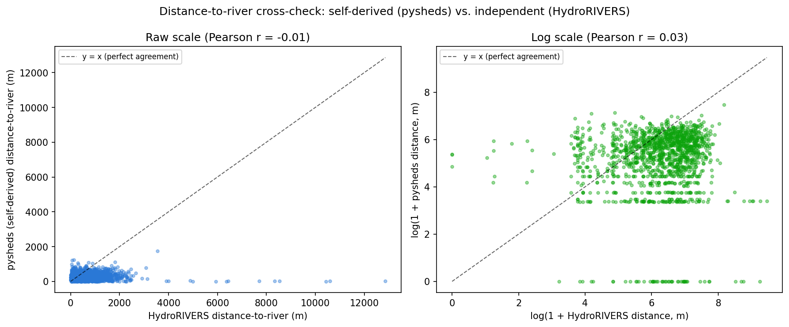

# Flood Susceptibility

A standalone FastAPI service that scores how flood-prone a piece of ground is **by nature** — its
elevation, slope, distance to the nearest river, drainage density, and land cover — for 30 monitored
river-gauge locations across Bangladesh (and any arbitrary lat/lon, snapped to the nearest one).

This folder is **fully self-contained** — copy the whole folder to any computer with Python installed
and it will work, with no dependency on anything else.

This guide assumes you are **not** using Claude Code or any AI assistant — every step is a plain
command you type yourself.

---

## What this model answers

This is a **spatial and static** question, not a weather-driven one: *how flood-prone is this ground by
nature*, independent of today's rain or river level. None of elevation/slope/drainage/land-cover
changes day to day, so this doesn't need live data at all — it's asking "if it floods nearby, is this
exact patch of ground the kind that goes under, or the kind that stays dry?"

## How it works



## What's in this folder

| File | What it does |
|---|---|
| `main.py` | The web server (FastAPI) — this is what you actually run |
| `susceptibility_model.py` | Loads the per-station lookup table (and the full trained model, for reference) and serves scores |
| `stations.py` | The list of 30 monitored stations and their coordinates |
| `schemas.py` | Defines the shape of the API's request/response data |
| `models/per_station_susceptibility.csv` | Pre-computed susceptibility scores for a 7x7 grid around each station — what the API actually reads at request time |
| `models/susceptibility_random_forest.joblib` | The full trained Random Forest model, included for reference / offline re-scoring of new points (not loaded by the live API — see below) |
| `models/metrics.json` | Evaluation metrics from training (see below) |
| `requirements.txt` | The list of Python packages this needs |

## How it was built (summary)

- **1,470-point spatial grid**: a local 7x7 grid (~10km radius) around each of the 30 monitored
  stations.
- **Labels**: aggregated across the entire 2016–2026 Copernicus GFM (Sentinel-1 SAR) archive per
  point — 918,423 total observations, ~625 per point on average. A point is "flooded" if it was ever
  observed flooded across that whole archive; "non-flooded" only if observed 200+ times with zero
  detections (a deliberately strict bar for trusting a negative). 362 positive / 1,019 negative / 89
  dropped for insufficient data.
- **Features**: elevation, slope, distance-to-river, drainage density (self-computed from Copernicus
  DEM GLO-30 via `pysheds` flow-routing — free, no registration) + land-cover class (ESA WorldCover,
  also free/no-key).
- **Model**: Random Forest, chosen over LightGBM by a real head-to-head on spatial cross-validation
  (0.892 vs 0.879 mean ROC-AUC) — matches a Bangladesh-specific finding in the literature that plain
  RF can beat gradient boosting in hilly terrain, and this grid spans both the flat delta and the hilly
  Chittagong Hill Tracts.
- **Evaluation — spatially honest, not just cross-validated**: 7 of 30 stations (`CH01`, `CO01`, `DH01`,
  `GO02`, `KU01`, `SW267`, `TE02` — stratified across all 4 basins, so the test set still covers flat
  floodplain, haor wetlands, AND hills) were held out completely — never touched during training or
  model selection. Final result on that genuinely unseen set: **ROC-AUC 0.908, PR-AUC 0.785** (326 test
  points, train/test split 1,055/326). Random-split evaluation (what a lot of published susceptibility
  papers do) is documented to inflate AUC by 5–15% on spatially autocorrelated data like this — this
  number is real, not the inflated kind.

The scripts that produced the training table and the model itself (DEM flow-routing, land-cover
extraction, Copernicus GFM label aggregation, Random Forest training/evaluation) aren't included in
this folder — this repo ships the finished, trained artifacts and the serving API only.

<p align="center">
  <br>
  <sub><i>ROC curve, Precision-Recall curve, and confusion matrix on the 7-station held-out spatial test set.</i></sub>
</p>

<p align="center">
  <br>
  <sub><i>Spatial GroupKFold cross-validation: LightGBM vs. Random Forest — the head-to-head that decided the model choice.</i></sub>
</p>

<p align="center">
  <br>
  <sub><i>SHAP feature importance for the final Random Forest model — land-cover class and slope dominate.</i></sub>
</p>

<p align="center">
  <br>
  <sub><i>All 30 stations plotted by real coordinates, colored by mean modeled susceptibility.</i></sub>
</p>

<p align="center">
  <br>
  <sub><i>Mean susceptibility by basin (error bars = standard error) — the flat delta basins score
  higher than the hilly Chittagong Hill Tracts, as expected.</i></sub>
</p>

<p align="center">
  <br>
  <sub><i>Final label composition across all 1,470 grid points: 362 flooded, 1,019 non-flooded, 89
  dropped for insufficient observation depth.</i></sub>
</p>

<p align="center">
  <br>
  <sub><i>Observation depth per point — the full 2016–2026 archive gives most points hundreds of
  independent looks, which is what makes the strict "200+ clean observations" bar for a trusted
  negative label possible.</i></sub>
</p>

<p align="center">
  <br>
  <sub><i>Per-station mean susceptibility score, all 30 stations, colored by basin.</i></sub>
</p>

<p align="center">
  <br>
  <sub><i>Flooded-point rate by land-cover class — water and low-lying cropland classes show
  substantially higher flood rates than built-up/forested classes, as expected.</i></sub>
</p>

<p align="center">
  <br>
  <sub><i>The empirical cross-check that decided the distance-to-river feature variant used in
  production — tested, not assumed.</i></sub>
</p>

## Why the API doesn't compute features live

Deriving slope/drainage-density for a brand-new point means loading and flow-routing a ~50MB DEM tile
(30–60 seconds) — unusable for an interactive dashboard call. Instead, every one of the 30 stations'
49-point neighborhoods was already scored once at training time (`models/per_station_susceptibility.csv`);
this service just looks up (or nearest-station-snaps for an arbitrary lat/lon) into that table.
`rasterio`/`pysheds`/`scikit-learn` are **not** runtime dependencies of this package — that's why
`requirements.txt` here is much shorter than a typical ML-serving service's.

## Running it on your own computer

```
python -m venv .venv
```
Activate it (`.venv\Scripts\activate.bat` on Windows Command Prompt, `.venv\Scripts\Activate.ps1` on
PowerShell, `source .venv/bin/activate` on Mac/Linux), then:
```
pip install -r requirements.txt
uvicorn main:app --reload --port 8002
```
Open **http://127.0.0.1:8002/docs** for interactive API docs, or try:
```
curl "http://127.0.0.1:8002/predict?station_id=SW267"
```

### `GET /health`
Quick check that the server and lookup table loaded. Returns `{"status": "ok", ...}`.

### `GET /stations`
Lists all 30 monitored stations with their ID, name, river, and coordinates.

### `GET /predict`
Call with either `station_id` (e.g. `?station_id=SW267`) or `lat`/`lon` (nearest-station-snapped).
Returns the susceptibility score and its interpretation for that location.

## Combining with a temporal (weather-driven) flood model

If you're pairing this with a separate model that predicts *when* a flood might happen (e.g. from live
rainfall/river data), a simple, defensible way to combine the two:

```
combined_risk = temporal_model_probability x (0.5 + 0.5 x susceptibility_score)
```

Susceptibility acts as a bounded modulator — it never fully zeroes out the temporal signal, since a
genuinely extreme storm can still flood low-susceptibility ground — rather than a black-box meta-model.
One formula, one slide, defensible in thirty seconds.

## Deployment notes

Same as any FastAPI service: don't use `--reload` in production (`uvicorn main:app --host 0.0.0.0
--port 8002` instead), and lock down CORS in `main.py` (`allow_origins=["*"]` is fine for local testing,
not for a public deployment) to your actual website's domain.

## Troubleshooting

- **`ModuleNotFoundError`** — activate the virtual environment before running `uvicorn`, or run
  `pip install -r requirements.txt` first.
- **Lookup table not found** — make sure you copied the entire folder, including `models/`.
