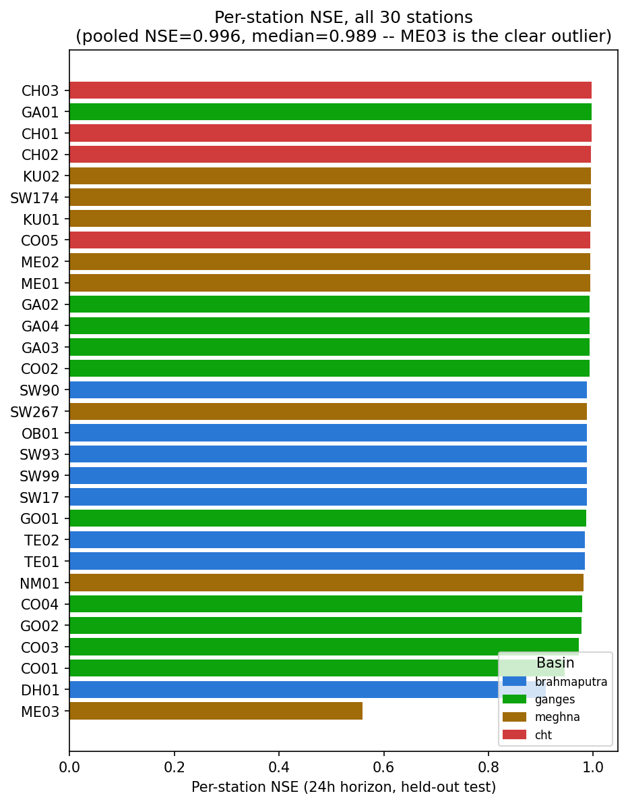

# River Discharge Forecaster — Defense Guide

*A plain-language companion to `Discharge_Forecaster_Model_Report.pdf`. Read this first to get the
whole model in your head quickly; go to the full report only for the literature tables and appendix.*

---

## 1. The 60-second summary

This model predicts a **number**: how much water (m³/s) will be flowing through a station's river 24,
48, and 72 hours from now. It was built as a **pivot alongside**, not instead of, the flood-risk
classifier (model #1) — instead of a rare, hard-to-predict flood/no-flood event, discharge is a
continuous, densely-observed value every single day, which makes it a fundamentally more tractable
regression problem. Three independent LightGBM regressors (24h/48h/72h), pooled across all 30 stations.

The headline result: it beats a naive "tomorrow = today" persistence baseline on MAE by **+11.1% at
24h, growing to +28.2% at 72h** — real, growing added skill, exactly the shape you'd want from a model
that's forecasting rather than echoing.

---

## 2. How it works, in plain terms

1. **Same live inputs as the classifier**: live rainfall (local + upstream), soil moisture, current
   discharge — free public data (Open-Meteo), same feature-engineering pipeline as model #1, only the
   target differs.
2. **A log1p-transformed target**: discharge spans roughly **5 orders of magnitude** across stations —
   from ~2 m³/s at Dhaka's Buriganga to ~39,000 m³/s at the Padma-Meghna confluence. Training on raw
   m³/s would let a plain squared-error loss get dominated entirely by the biggest rivers, effectively
   producing a Jamuna/Padma-only model. `log1p` makes the loss behave like a relative (percentage-ish)
   error at every station's own scale, and safely handles the handful of stations with exact-zero
   discharge (`log1p(0)=0`, whereas plain `log(0)` is undefined). Predictions are converted back to
   real units (`expm1`, clipped at 0) before being reported.
3. **Output**: a predicted discharge number per horizon, plus a rising/falling/steady trend versus
   today's actual reading.

   
  <i>Predicted vs. actual discharge (log-log scale), all 3 horizons, held-out test set — points
  hugging the diagonal across the full 5-order-of-magnitude range.</i>

---

## 3. The numbers you'll be asked about

| Horizon | Model NSE | Persistence NSE | Model KGE | Persistence KGE | MAE improvement over persistence |
|---|---|---|---|---|---|
| 24h | 0.9958 | 0.9950 | 0.9923 | 0.9965 | **+11.1%** |
| 48h | 0.9887 | 0.9835 | 0.9865 | 0.9904 | **+20.8%** |
| 72h | 0.9828 | 0.9705 | 0.9819 | 0.9836 | **+28.2%** |

**Training data**: 295,830 rows train / 28,462 rows test — same time-based split cutoff (Jan 1 2024) as
the classifier, for a directly comparable evaluation window.

**Why the persistence-MAE comparison is the headline, not the R²/NSE number**: pooled NSE (0.996 at 24h)
looks almost suspiciously good — well above the 0.85–0.89 typical in the reviewed literature. Checked
directly rather than just reported: pooling all 30 stations before computing NSE lets between-station
scale variance (discharge spans ~4 orders of magnitude) inflate the number relative to genuine
within-station skill. The honest per-station **median** NSE is still strong (0.989 at 24h) but that's
the number to actually trust, and the persistence-MAE comparison — which controls for scale entirely by
comparing each station only against its own naive baseline — is the real evidence of skill.

   
  <i>Per-station NSE, 24h — median 0.989, real and not pooling-inflated, but one station stands out
  (see Q4).</i>

---

## 4. Likely defense questions, answered

**Q1: Why log1p instead of just training on raw m³/s?**
Covered in §2 above — without it, the loss function would be dominated by the largest rivers alone.
This isn't a guess: station means were checked directly and really do span ~5 orders of magnitude.

**Q2: What are NSE and KGE, in plain terms?**
- **NSE (Nash-Sutcliffe Efficiency)**: 1.0 = perfect prediction, 0.0 = "you'd have done just as well
  always predicting the historical average," negative = worse than that. It's hydrology's most
  standard fit metric.
- **KGE (Kling-Gupta Efficiency)**: a refinement of NSE that separately scores three things —
  correlation (does it track timing?), variability ratio (does it capture the right amount of
  day-to-day swing?), and bias (is it systematically too high/low?) — so failures are diagnosable
  instead of hidden inside one blended number. Both are "now the most widely used indices in hydrology
  for evaluating streamflow models" per the literature reviewed for this model — not invented for
  convenience.

**Q3: The model's KGE is slightly BELOW persistence at 24h — doesn't that mean persistence is better?**
No — this is specifically decomposed in §6.2 of the full report, not glossed over. Breaking KGE into its
3 components shows the model's **correlation is consistently higher** (better) than persistence at every
horizon — it genuinely tracks the real timing better. But its **variability ratio is consistently
lower** — it slightly under-disperses, smoothing day-to-day spikes. This is a normal, well-understood
side effect of minimizing squared error (persistence's variance is definitionally identical to the true
series, just shifted by a day, so it can never smooth anything). That variability penalty is specifically
what drags the composite KGE score slightly below persistence at the shortest horizon, even while the
model is genuinely better on correlation and clearly better on MAE.

   
  <i>NSE and KGE, model vs. persistence, all 3 horizons.</i>

**Q4: Any real weaknesses found, not just theoretical ones?**
Yes, and it was found specifically *because* the per-station breakdown was checked rather than trusting
the pooled number: **ME03 (Dhaka's Buriganga)** — the smallest-discharge station in the whole network —
sits at NSE 0.56 at 24h and degrades to 0.30 by 72h, while every other station stays relatively stable
with lead time. Likely explanation: it's a small, possibly urban/regulated river more affected by local
factors the model's regional weather features don't capture. This is named specifically as a future-work
target (a small-river-specific feature, or trying Random Forest there specifically, since RF led a
Bangladesh-specific study on monthly extreme water levels).

**Q5: Why is MAPE reported at 180–3000%? Is the model actually that bad?**
No — this is a known, explained artifact of MAPE's own math: dividing by near-zero discharge on a small
river's driest days turns a tiny absolute error into a huge percentage. MAE, NSE, and KGE (all reported
throughout) are the trustworthy metrics here; MAPE is included for completeness and explicitly flagged
as not meaningful for this dataset, not quietly hidden.

**Q6: Why LightGBM and not Random Forest or a deep learning model?**
Literature comparisons at comparable data scale (mountainous-catchment gradient-boosting studies, and a
Bangladesh-specific study on the same Old Brahmaputra river system this project's OB01 station monitors)
show gradient boosting competitive with or beating deep learning approaches at this data volume.
Random Forest led a *different* Bangladesh study (monthly extreme water levels, a different task) — a
legitimate future head-to-head that hasn't been run for this specific task yet, flagged honestly as
future work rather than assumed away.

---

## 5. Weaknesses to own before they're asked

- Pooled NSE/KGE are somewhat inflated by between-station variance — always cite the per-station median
  alongside the pooled number, never instead of it (Q3 above).
- ME03 (Dhaka's Buriganga) is a genuine, disclosed weak point that worsens with lead time (Q4).
- NSE/KGE themselves have documented critiques (sensitive to daily streamflow's skew, not meant for
  cross-site comparison) — reported as a supplement to the persistence comparison, not a replacement
  for it.
- MAPE is not a trustworthy metric for this dataset (Q5) — reported anyway, for completeness, with the
  caveat attached.

## 6. If they only remember one thing

A regression model that grows more valuable, not less, the further out it forecasts — +11% MAE
improvement over naive persistence at 24h, +28% at 72h — with every honest wrinkle (pooled-metric
inflation, one weak station, a diagnosed KGE quirk) checked directly and reported, not glossed over.
