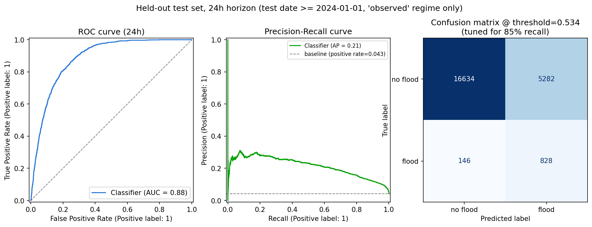
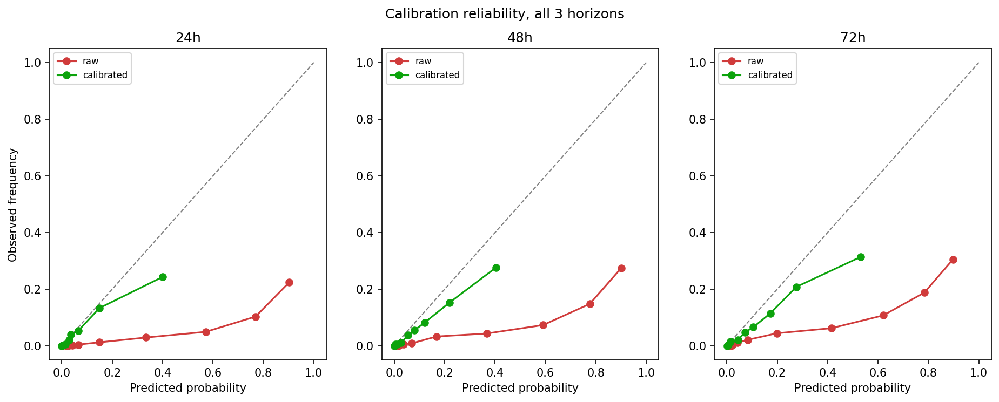
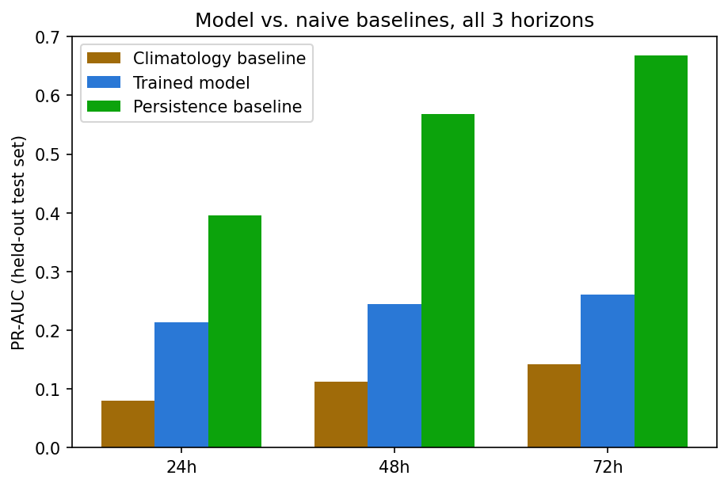
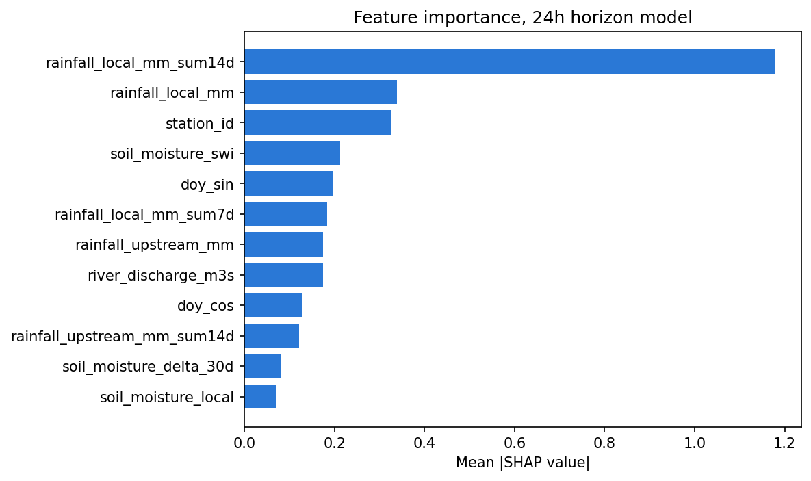

# Flood Risk Classifier — Defense Guide

*A plain-language companion to `Flood_Risk_Classifier_Model_Report.pdf`. Read this first to get the
whole model in your head quickly; go to the full report only for the literature tables and appendix.*

---

## 1. The 60-second summary

This model answers one question: **will this station flood in the next 24, 48, or 72 hours?**, using
today's live rainfall, soil moisture, and river discharge. It's not one model — it's **three
independent LightGBM classifiers**, one per horizon, each trained across all 30 monitored stations at
once (not one model per station). Each one outputs a flood probability; a tuned threshold turns that
into a low/moderate/high risk level.

The single most important thing to know walking in: the model **beats a "no rain expected" climatology
baseline clearly, but does not beat a "tomorrow will look like today" persistence baseline** on the
metric that matters most (PR-AUC). This is reported honestly in the full report (§8), not hidden — and
it has a credible, stated explanation (see Q6 below).

---

## 2. How it works, in plain terms

1. **Inputs, live, every request**: rainfall at the station and its upstream catchment, soil moisture,
   and current river discharge — pulled from free public APIs (Open-Meteo), not paid data.
2. **A borrowed signal**: each horizon's classifier also gets that same horizon's own discharge
   forecast (from the companion discharge-forecasting model, bundled inside this model's own
   `models/discharge_cascade/`) as an extra input — tested to genuinely help, not just added on faith.
3. **Three separate models, not one**: a 24h model, a 48h model, a 72h model — each trained
   independently rather than one sequence model predicting all three. This avoids compounding errors
   that a step-by-step (recursive) forecast would build up over longer horizons — the field calls this
   the "direct multi-step" strategy, and it's the standard choice for exactly this reason.
4. **A tuned decision threshold**: rather than the default 50% cutoff, each horizon's threshold is
   chosen to catch **85% of real floods** (recall), accepting more false alarms in exchange — because
   in an early-warning system, a missed flood is far more costly than an extra warning.
5. **Output**: a risk level (low/moderate/high) per horizon, plus the raw probability and a
   plain-language "reasoning" field explaining what drove the call.

   
  <i>24h horizon: ROC-AUC 0.883, PR-AUC 0.214, on a genuinely held-out test set (everything after
  Jan 1 2024 — never seen during training).</i>

---

## 3. The numbers you'll be asked about

| Horizon | ROC-AUC | PR-AUC | Recall (tuned) | Precision (tuned) |
|---|---|---|---|---|
| 24h | 0.883 | 0.214 | 85.0% | 13.6% |
| 48h | 0.864 | 0.245 | 85.0% | 16.1% |
| 72h | 0.849 | 0.261 | 85.0% | 18.2% |

**Training data**: 77,960 rows (24h horizon), test set 22,890 rows — a strict **time-based split**
(train = everything before Jan 1 2024, test = everything after). Never a random shuffle, because a
random split would let information from a day right next to a training day leak into the test set.

**Calibration** (§6.3, §9 of the full report): a separate isotonic calibrator was trained per horizon
and measurably fixes the raw model's overconfidence (a raw "90% chance" really only happened ~23% of
the time; calibration closes most of that gap — see the figure below). **It is not yet wired into the
live API** — the live `/predict` endpoint still returns the raw, uncalibrated probability. This is a
disclosed, known gap, not an oversight: the decision threshold (which drives the risk level you actually
see) was tuned on raw scores and works correctly regardless; only the numeric probability shown to a
user would look more honest with calibration wired in.

   
  <i>Raw vs. calibrated reliability, all 3 horizons — three separate proper scoring rules (Brier,
  log loss, ECE) all agree calibration is a real improvement.</i>

---

## 4. Likely defense questions, answered

**Q1: Why LightGBM, not a neural network / LSTM?**
The literature is explicit that deep sequence models need large data volumes to beat gradient boosting —
Google's own Flood Hub trains on thousands of gauges; this project has 30. Multiple papers also note
gradient-boosted trees are specifically well-suited to rare-event, imbalanced classification like this.
LightGBM matches both findings, not just convenience.

**Q2: Why is precision so low (14–18%)?**
Deliberate, not accidental. The threshold was tuned to catch 85% of real floods, which necessarily means
accepting more false alarms — a documented trade-off (§4.3), because in this context a missed flood is
far worse than an extra warning. A higher-precision threshold is one config change away if a different
trade-off is ever wanted.

**Q3: What does ROC-AUC / PR-AUC actually mean, in plain terms?**
- **ROC-AUC**: how well the model ranks a random flooded day above a random non-flooded day. 1.0 =
  perfect, 0.5 = coin flip. 0.88 means it's genuinely good at telling the two apart.
- **PR-AUC**: focuses specifically on the rare positive (flood) class — a much harder bar than ROC-AUC
  when floods are rare. The "random guessing" baseline for PR-AUC here is roughly the true positive
  rate (~4% at 24h), so a PR-AUC of 0.214 is over 5x better than random, even though it "sounds" low.

**Q4: How was class imbalance (floods are rare) handled?**
Not with a blanket `class_weight="balanced"`. A custom sample-weighting scheme was built from the real
observed class balance in the most-trusted label subset, with an extra confidence discount for
lower-trust label sources (event catalogs vs. direct satellite detections) — because the raw labels come
from 4 sources of differing reliability, not one clean ground truth.

**Q5: What does "calibration" mean and why does it matter here?**
A raw model's "70% probability" doesn't necessarily mean the event actually happens 70% of the time —
this model's raw output was badly overconfident. Calibration is a second, separate model fit on
top that corrects the *stated* probability to match *reality*, without touching the underlying
ranking or the tuned decision threshold. See §3 above for its current (not-yet-live) status.

**Q6: Does this model actually add value, or is it just noise dressed up as a forecast?**
The honest answer, stated plainly in the report's §8: on the pooled PR-AUC metric, it does **not** beat
a naive "tomorrow = today" persistence baseline (0.396 vs. the model's 0.214 at 24h). The working,
not-yet-proven explanation: flood labels cluster in multi-day contiguous blocks (real floods last
several days), so persistence is unusually strong specifically at predicting the *continuation* of an
already-ongoing flood — arguably the easiest, least-skill-requiring part of the problem. The model's
real value is plausibly concentrated in predicting flood **onset** — a brand-new event persistence can
never predict, since by definition it only ever repeats yesterday's label. This is flagged as the
single highest-priority next investigation, not swept under the rug.

   
  <i>Model PR-AUC vs. climatology and persistence baselines, all 3 horizons — the honesty check
  from Q6.</i>

**Q7: How does this compare to the 97%+ accuracy Bangladesh studies you'll get asked about?**
Those numbers are almost always solving an easier problem — static classification, usually on a random
(not time-based) split — not this model's genuine temporal forecasting on a strict time-ordered holdout.
Accuracy is also a misleading metric here: on an imbalanced dataset, a model that always predicts "no
flood" scores high on accuracy while being useless. That's exactly why this report uses PR-AUC and
recall instead of accuracy — the field's own recommended metrics for this kind of problem, not a metric
invented for convenience.

**Q8: What's SHAP, and why is it in this report?**
SHAP explains *which input features drove a specific prediction* — e.g., "this alert fired mainly
because of 14-day cumulative rainfall," not just a black-box number. The 2025 XAI literature frames this
explicitly as a trust requirement for disaster-management adoption, not a nice-to-have visualization.

   
  <i>14-day cumulative local rainfall dominates the 24h model's decisions.</i>

---

## 5. Weaknesses to own before they're asked

- Doesn't beat persistence on pooled PR-AUC (Q6) — the single most important limitation, already
  covered above so it never looks like it was hidden.
- Calibration exists but isn't live yet (§3).
- Precision is genuinely low at the tuned threshold (13–18%) — disclosed as a structural, deliberate
  consequence, not a bug (Q2).
- Even after calibration, the model rarely predicts very high probabilities (tops out around ~40% mean
  predicted probability at 24h even when calibrated) — a real, bounded improvement, not a complete fix.

## 6. If they only remember one thing

Three independent, time-split-evaluated LightGBM classifiers, deliberately tuned to catch 85% of real
floods at the cost of more false alarms, honestly reported against naive baselines — including the one
place (persistence) where it doesn't yet win, with a credible, stated reason why and a clear next step.
