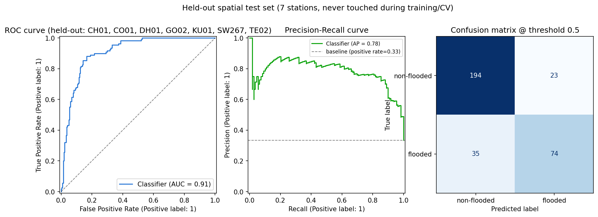
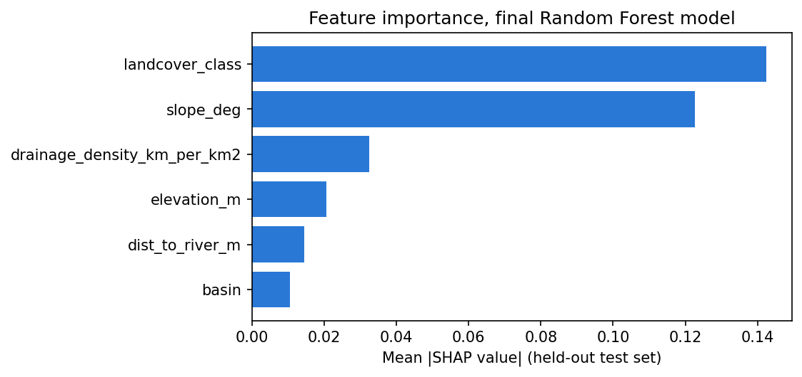

# Flood Susceptibility Model — Defense Guide

*A plain-language companion to `Flood_Susceptibility_Model_Report.pdf`. Read this first to get the
whole model in your head quickly; go to the full report only for the literature tables and appendix.*

---

## 1. The 60-second summary

Models #1 and #2 both ask a moving question: *will conditions here get dangerous soon*, using live
weather. This third model asks a **fixed** question instead: **is this specific patch of ground, by its
own geography, the kind that floods — or the kind that stays dry** — independent of any particular
storm, using only elevation, slope, distance to the nearest river, drainage density, and land cover.
It doesn't compete with the other two models; it answers something they structurally cannot, since
terrain doesn't change day to day. All three combine into one transparent formula (§6 below).

Final, honestly-evaluated result on stations the model **never saw during training**: **ROC-AUC 0.908,
PR-AUC 0.785**.

---

## 2. How it works, in plain terms

1. **A local grid, not a national map**: a 7×7 grid (49 points, ~10km span) around each of the 30
   monitored stations — 1,470 points total. Scoped to what this project actually monitors, not an
   attempt at a full Bangladesh atlas.
2. **Labels come from real satellite observation, not guesswork**: every point was checked against the
   **entire 2016–2026 Copernicus Sentinel-1 SAR archive** — 918,423 total real observations. A point is
   "flooded" if the archive ever caught it flooded once; "non-flooded" only if it was cleanly observed
   200+ times with zero detections — a deliberately strict, *inspected* bar (median depth was 575
   observations/point, comfortably above 200), not an arbitrary number.
3. **Terrain features, mostly self-derived**: elevation and slope come from Copernicus DEM GLO-30 via
   real flow-routing (pysheds); land cover from ESA WorldCover. Distance-to-river was self-derived
   originally, then **replaced after a real cross-check** (see Q4 — a good story for a defense).
4. **Model**: Random Forest — chosen after a real head-to-head against LightGBM, not assumed just
   because the other two models use LightGBM.
5. **No live computation at request time**: since terrain doesn't change day to day, every point's score
   was computed once at training time and saved to a lookup table — the live API is a fast table lookup,
   not a 30-60 second DEM-processing call.

<p align="center">
  <br>
  <sub><i>All 30 stations by real coordinates, colored by mean susceptibility — Meghna-basin
  haor/wetland stations score highest, Chittagong Hill Tracts stations lowest, matching known Bangladesh
  flood geography.</i></sub>
</p>

---

## 3. The numbers you'll be asked about

| Evaluation | ROC-AUC | PR-AUC |
|---|---|---|
| Spatial GroupKFold CV, Random Forest | 0.888 (mean) | — |
| Spatial GroupKFold CV, LightGBM | 0.862 (mean) | — |
| **Held-out test (7 stations, never touched in training)** | **0.908** | **0.785** |

7 of 30 stations — stratified across all 4 basins, so the held-out set still spans flat floodplain, haor
wetlands, *and* hills — were held out completely, never touched during training or model selection.

<p align="center">
  <br>
  <sub><i>ROC curve, Precision-Recall curve, and confusion matrix on the held-out spatial test set.</i></sub>
</p>

---

## 4. Likely defense questions, answered

**Q1: Why does this model score "only" 0.91 ROC-AUC when other Bangladesh studies report 97%+
accuracy?**
Two separate reasons, both real, not excuses. First, accuracy and ROC-AUC measure different things —
accuracy can look high on an imbalanced dataset even from a mediocre model. Second, and more important:
random train/test splits on spatial data are **documented in the literature to inflate reported AUC by
5–15%**, because nearby points are correlated (if point A floods, its neighbor 200m away probably does
too). This model's 0.908 comes from **7 whole stations held out completely** — the harder, more honest
evaluation standard. Most reviewed studies don't disclose whether they controlled for this at all.

**Q2: What is "spatial cross-validation" and why does it matter more here than a normal split would?**
A normal random split can put point A in training and its next-door neighbor point B in test — B is
then trivially easy to predict because it's basically the same ground as something the model already
saw, which inflates the score without proving real generalization. Spatial GroupKFold groups all of a
station's points together in the same fold, so no fold ever trains on a point spatially close to one
it's tested on. This project went further and additionally held out entire stations end-to-end.

**Q3: Why Random Forest instead of LightGBM, when your other model uses LightGBM?**
Not assumed — tested head-to-head on identical data via spatial cross-validation (0.888 vs. 0.862 mean
ROC-AUC, RF wins). This matches an independent, Bangladesh-specific literature finding that plain RF can
beat gradient boosting specifically in hilly terrain — and this grid genuinely spans both the flat delta
*and* the hilly Chittagong Hill Tracts, so the distinction was worth checking rather than assuming the
first model's choice would transfer.

<p align="center">
  <br>
  <sub><i>Spatial GroupKFold cross-validation: Random Forest wins on every fold.</i></sub>
</p>

**Q4: Tell me about a mistake you caught and fixed — walk me through it.**
Two real examples, good material for a defense since they show real verification discipline, not just
a clean narrative written after the fact:

- *Near-duplicate work avoided*: model #1 already has a peer-reviewed elevation/HAND terrain feature
  (from MERIT Hydro). Early in this model's design, before checking, a self-computed replacement was
  nearly built from scratch — which would have both duplicated existing work and produced a strictly
  *less* rigorous version of an already-correct feature. Caught before implementation.
- *A feature was cross-checked and swapped after the fact*: the self-derived distance-to-river feature
  (from DEM flow-routing) was compared point-by-point against HydroRIVERS, an independent,
  peer-reviewed global river network. The two barely correlated across the full grid (Pearson r ≈ 0.03).
  Rather than assume either was right, **both were empirically tested through the full training
  pipeline** — identical spatial CV, identical held-out test, changing only this one feature.
  HydroRIVERS won by a modest but real margin on the held-out test (0.908 vs. 0.902 ROC-AUC) and rests
  on an externally validated dataset rather than a self-computed one, so production was switched to it.
  The original self-derived version is kept in the data for provenance, not silently deleted.

<p align="center">
  <br>
  <sub><i>SHAP feature importance — land cover and slope dominate, consistent with flat deltaic terrain
  where these carry more signal than raw elevation.</i></sub>
</p>

**Q5: How does this combine with the other two models?**
One transparent formula, not a black-box stacked meta-model:

```
combined_risk = classifier_24h_probability × (0.5 + 0.5 × susceptibility_score)
```

Susceptibility acts as a **bounded modulator** (0.5×–1.0×) on the classifier's time-bound probability —
it can reduce a forecast for inherently low-risk ground, but never fully zeroes it out, since an
extreme enough storm can still flood low-susceptibility terrain. Chosen deliberately over a stacked
model so the combination logic stays defensible in one line, not requiring its own separate
justification.

**Q6: Why trust a 200-observation cutoff for a "non-flooded" label?**
It wasn't picked in advance — it was chosen *after* inspecting the real observation-count distribution
per point (median 575 observations, well above 200), specifically so the bar excludes very little real
data while still requiring substantial evidence before trusting a negative. It's disclosed as a real
limitation regardless (§10 of the full report): a small number of points near that exact boundary could
be relabeled under a different, similarly defensible cutoff.

---

## 5. Weaknesses to own before they're asked

- Scoped to 30 station neighborhoods (1,470 points), not a national susceptibility atlas — deliberate
  scope, not a shortcut.
- Land cover is a single 2021 snapshot (checked directly: no newer ESA WorldCover release exists yet) —
  land-use change over time isn't captured.
- The 200-observation threshold is inspected and reasoned, but still a threshold (Q6).
- Drainage density is still self-derived from a single DEM via flow-routing — not independently
  validated against ground survey, though the underlying DEM itself is independently accuracy-assessed
  as one of the better free global options. Distance-to-river no longer carries this caveat (Q4).
- HydroRIVERS itself is DEM-derived (from a coarser ~500m source), not ground-surveyed — an improvement
  in independence over the original feature, not an absolute ground-truth reference.
- The 7-station held-out test (326 points) is real but small — a larger held-out set would tighten the
  confidence interval around 0.908.

## 6. If they only remember one thing

A genuinely different, complementary question from the other two models — evaluated the hard way (whole
stations held out, never a random split), with two real examples of a design decision being checked
empirically instead of assumed, and a combination formula simple enough to defend in one line.
