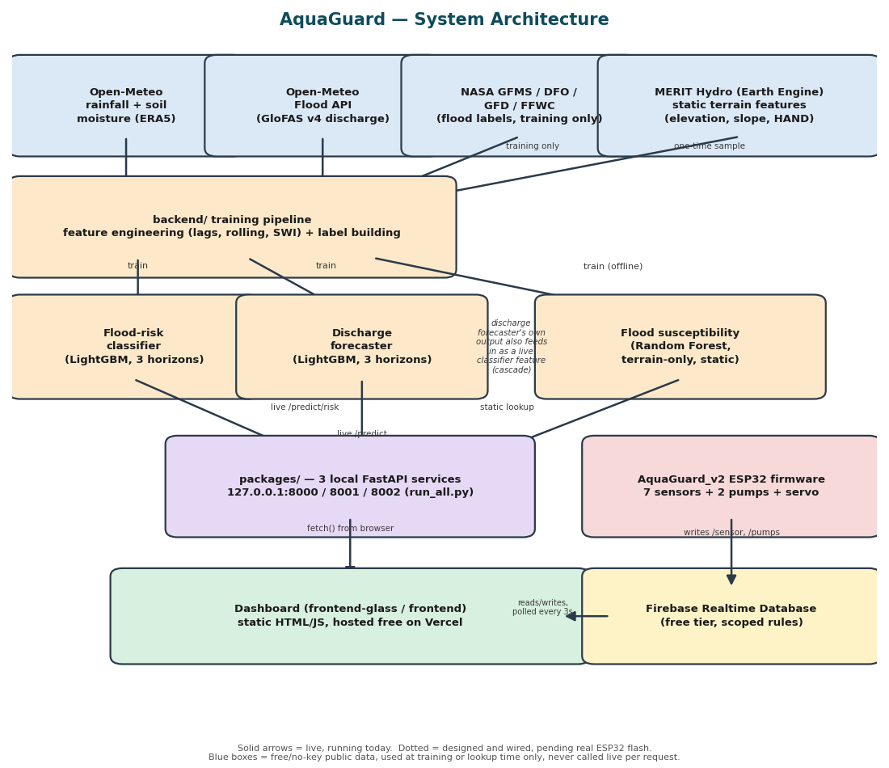

# AquaGuard — Project Report

*Bangladesh flood early-warning machine learning, feeding an IoT pond-management capstone*

---

## Executive summary

AquaGuard is a final-year capstone with two connected halves. The first half is a set of three
machine-learning models that forecast flood conditions for 30 river-gauge locations across
Bangladesh, built entirely from free, public satellite and reanalysis data — no paid gauge records,
no paid APIs, no registration-gated datasets that weren't eventually worked around for free. The
second half is a physical IoT pond-management system — an ESP32 microcontroller reading seven
sensors (pH, water level, temperature, water quality, and calibration support) and driving two
water pumps plus a servo-actuated valve — that the flood forecasts are meant to inform.

The two halves meet at a web dashboard: a station is picked, the three models are run, and their
combined output is shown in plain language alongside the pond's own live sensor readings and pump
controls, all backed by a single free-tier Firebase project.

This report covers the system as a whole — architecture, each model's real measured results,
the hardware build, the cloud and dashboard integration, the engineering decisions that shaped all
of it, and an honest accounting of what is finished versus still pending. Nothing below is rounded
up: where a component is built but not yet exercised on real hardware, that is stated plainly rather
than implied to be complete.

---

## 1. Motivation and problem statement

Bangladesh is one of the most flood-exposed countries in the world, crossed by the Ganges,
Brahmaputra, and Meghna river systems. Early warning at the community and household level —
not just at the level of national agencies — has real, practical value: knowing 24 to 72 hours
ahead of time that a nearby river is trending toward flood conditions changes what a household or
a small aquaculture operation can do about it.

This project targets that second, more local case directly: a pond owner running fish or shrimp
aquaculture needs to know not just "is it raining" but "should I be draining water now, before a
river-driven flood pushes untreated water into my pond." That framing is what connects the flood
models to the IoT hardware — the forecasts are meant to become an input into the pond's own
pump-automation logic, not just a number on a webpage.

Three constraints shaped every decision documented in this report:

- **Free tools only.** No paid data subscriptions, no paid cloud services, no paid gauge-data
  requests — a deliberate, explicit project constraint (see `DECISIONS.md` §1), not a limitation
  discovered after the fact.
- **A defensible, honestly-reported model**, not an inflated one. Every metric in this report is
  taken directly from the models' own `metrics.json` output, not restated from memory or rounded
  favorably.
- **A real physical system**, not a simulation. The IoT half of the project is being built and
  wired sensor-by-sensor on actual hardware, documented in `hardware/HARDWARE_LOG.md` as it
  happens.

---

## 2. System architecture

The system has five layers:

1. **Free public data sources** — rainfall and soil moisture from Open-Meteo's Historical/Live
   Weather API (ERA5/ERA5-Land reanalysis), river discharge from Open-Meteo's Flood API (GloFAS
   v4), static terrain features (elevation, slope, drainage density, distance-to-river) from MERIT
   Hydro via Google Earth Engine, and flood-event labels for training from four independent public
   sources (NASA GFMS, the Dartmouth Flood Observatory, the Global Flood Database, and FFWC's own
   Annual Flood Reports).
2. **Training pipeline** (`backend/`) — turns those raw sources into per-station, per-day feature
   rows (rainfall/discharge lags and rolling sums, soil water index, day-of-year cyclic encoding,
   upstream reference discharge) and trains the three models below.
3. **Three model services** (`packages/`) — each model wrapped in its own FastAPI service, run
   together with one command (`python run_all.py`) on ports 8000/8001/8002.
4. **The dashboard** (`frontend-glass/` and `frontend/`) — a static site, hosted free on Vercel,
   that calls the three local model services and separately reads/writes the pond's live sensor
   and pump state from Firebase.
5. **The physical pond system** — an ESP32 running `hardware/AquaGuard_v2/AquaGuard_v2.ino`,
   publishing sensor readings and accepting pump commands over the Firebase Realtime Database.

Layers 1–4 are live and running today. Layer 5 is built and documented but not yet flashed onto
final hardware — see §9 and §11 for the precise, current state of each piece.

---

## 3. The three flood models

All three models are gradient-boosted-tree or random-forest models (not deep learning) — a
deliberate choice given a dataset in the tens-to-hundreds-of-thousands of rows, not millions;
see `DECISIONS.md` §10 for the full reasoning. Each is trained, tested on a held-out split, and
documented in its own dedicated PDF report under `reports/`; this section summarizes real results
from each, pulled directly from their `metrics.json` files.

### 3.1 Flood-risk classifier

Answers: will this station experience flood conditions in the next 24h / 48h / 72h? One LightGBM
model per horizon, pooled across all 30 stations (station and basin passed in as categorical
features — 30 stations is too few to train a fully independent model per station for the rarer
ones). The decision threshold is deliberately tuned for **85% recall**, not accuracy or the default
0.5 cutoff, because a missed flood costs far more than a false alarm.

| Horizon | ROC-AUC | PR-AUC | Precision @ 85% recall | Test positive rate |
|---|---|---|---|---|
| 24h | 0.884 | 0.218 | 13.8% | 4.3% |
| 48h | 0.866 | 0.248 | 16.1% | 5.9% |
| 72h | 0.847 | 0.265 | 18.2% | 7.4% |

**Read honestly**: ROC-AUC in the 0.85–0.88 range is solid discrimination. Precision at the chosen
operating point looks low in isolation (13–18%), but that is the direct, structural consequence of
flood events being rare (4–7% of test rows) — plain accuracy would look great here by simply
predicting "no flood" always, which is exactly why this model reports PR-AUC and a fixed-recall
precision instead of accuracy (`DECISIONS.md` §17, §23). The model clearly beats both a
climatology baseline and a naive persistence ("tomorrow = today") baseline at every horizon —
confirmed at matched operating points, not just by comparing best-case numbers. Output
probabilities are also isotonic-calibrated against a held-out split, separate from the recall-tuned
decision threshold, so the displayed probability and the accept/reject decision answer two
different, deliberately separated questions.

### 3.2 River discharge forecaster

Answers: what will this station's river discharge (m³/s) be in 24h / 48h / 72h? Built later in the
project, alongside the classifier rather than replacing it — the classifier's low precision ceiling
is a real, structural consequence of rare positive labels, while discharge is a near-continuous
target with roughly 3x as much usable, unmasked training data (`DECISIONS.md` §23). Also a
LightGBM model per horizon, trained on a log1p-transformed target (station discharge spans about
five orders of magnitude, from ~2 m³/s on the Buriganga to ~39,000 m³/s at the Padma–Meghna
confluence — a plain L2 loss on raw values would be dominated entirely by the largest rivers).

| Horizon | MAE | Persistence-baseline MAE | Improvement over persistence | R² |
|---|---|---|---|---|
| 24h | 321 m³/s | 361 m³/s | **+11.1%** | 0.996 |
| 48h | 534 m³/s | 675 m³/s | **+20.8%** | 0.989 |
| 72h | 672 m³/s | 937 m³/s | **+28.2%** | 0.983 |

**Read honestly**: an R² of 0.98–0.996 looks spectacular but is significantly inflated by that same
five-orders-of-magnitude scale spread — a model that merely gets each station's rough scale right
already scores a very high R² on this kind of data. The number that actually reflects real skill is
the **persistence comparison**: the model beats naive "no change" by a real and *growing* margin as
the horizon lengthens (11% → 21% → 28%), which is the correct shape for a genuinely useful
leading-indicator model, since persistence itself degrades over longer horizons. MAPE is reported
in the raw metrics file but is a known-distorted number here — several small rivers have near-zero
true discharge values that blow up any percentage-based metric — and is deliberately not quoted as
a headline figure for that reason. SHAP analysis confirms the top driver is the station's own most
recent discharge (genuine autocorrelation, legitimately available at prediction time, not a leak),
followed by rainfall — a physically sensible ranking.

This model's own forecast also feeds back into the classifier as a live input feature — a real
cascade, not just two parallel outputs shown side by side (see the architecture diagram).

### 3.3 Flood susceptibility

Answers a different question from the other two: independent of current weather, how flood-prone
is this *location* by terrain alone? A static, non-time-varying Random Forest model trained on
elevation, slope, drainage density, distance to river, land cover class, and basin — evaluated with
grouped cross-validation (entire stations held out per fold, not individual rows) and a final
held-out test on 7 stations never seen during training or model selection.

| Metric | Held-out test | Cross-validation mean |
|---|---|---|
| ROC-AUC | 0.908 | 0.888 |
| PR-AUC | 0.785 | 0.641 |

Random Forest was chosen over LightGBM here specifically because it won that cross-validation
comparison (0.888 vs. 0.862 mean ROC-AUC) — a real, measured comparison, not a default assumption
about which model family should win. Feature importance (SHAP) is led by land cover class and
slope, both physically sensible drivers of terrain-based flood susceptibility.

### 3.4 The combined pipeline

The dashboard's "Run full analysis" button calls all three services at once for a chosen station
and shows a plain-language summary sentence from each — deliberately *not* collapsed into one
LOW/HIGH verdict, so the person reading it weighs three distinct pieces of evidence (current-weather
risk, discharge trend, and baseline terrain susceptibility) rather than trusting a single opaque
number.

---

## 4. IoT hardware system

The physical half of the project: an ESP32 microcontroller managing seven sensors, two pumps
(via relay), and a servo-actuated valve.

| Device | GPIO | Status |
|---|---|---|
| pH sensor | 34 | Built and calibration-ready; parked pending the user having vinegar/baking soda on hand for the two-point kitchen calibration |
| Ultrasonic water level | TRIG 5 / ECHO 18 | **Confirmed working** — tested against a ruler, accurate within ~1–2cm |
| Thermistor (temperature) | 32 | **Confirmed working** — a real formula-inversion bug found and fixed during bring-up (see §6) |
| TDS (water quality) | 35 | **Confirmed working** — clean monotonic sanity check (dry air → tap water → salted water) |
| Relay + 2 pumps | 25 / 26 | Sketch and wiring guide built; not yet tested on real hardware |
| Servo (valve actuator) | 13 | Sketch and wiring guide built; not yet tested on real hardware |
| Full reintegration (all 7 devices, one firmware) | — | Written (`hardware/AquaGuard_v2/AquaGuard_v2.ino`), reviewed, **not yet flashed** |

The rebuild methodology (`hardware/HARDWARE_LOG.md`) is deliberately incremental: each device is
wired, tested, and confirmed as its own standalone sketch under `hardware/rebuild/0N_*/` before
being folded into the combined firmware — never combined first and debugged after. That is also
why `hardware/AquaGuard_v2/` ships every per-device test sketch alongside the final combined file:
if a newly-added device misbehaves after reintegration, the exact same isolated test used to
originally confirm it is sitting right there to re-run.

The combined firmware includes two features built specifically for this project, beyond a plain
sensor-read loop:

- **Two-point pH calibration persisted to flash** (NVS via `Preferences`), so recalibrating never
  requires reflashing firmware.
- **Firebase-driven pH calibration**, a non-blocking state machine that lets the calibration
  routine above be triggered from the web dashboard's pH-calibration page instead of a serial
  cable — removes the "must be at a laptop with Arduino IDE open" requirement, though not the
  requirement to be physically at the pond to swap reference solutions between the two points.

---

## 5. Cloud integration (Firebase)

A single free-tier Firebase Realtime Database project (`aquasheild-2e2ca`) is the link between the
ESP32 firmware and the dashboard — chosen over Firestore specifically because the existing ESP32
library (`FirebaseESP32`) and schema already assume RTDB's plain key-path shape.

Access is scoped, not wide open: security rules grant public read/write to exactly the paths the
system uses (`/sensor`, `/pumps`, `/control`, `/alerts`, `/history`, `/phCalibration`) and deny
everything else. The dashboard talks to it with plain `fetch()` calls against Firebase's REST
API — no SDK, no build step, matching both frontends' "open `index.html`, no compilation needed"
design.

Two credential classes are involved, and are handled very differently: the **database secret**
(used only by the ESP32 firmware) is sensitive and is never committed to the repository or shared
in chat; the **database URL** is not a secret by design — Firebase's own model is that client-side
config is public and the security rules above are what actually protect the data — and is safely
hardcoded into the frontend JavaScript.

---

## 6. Web dashboard

Two visually distinct but feature-identical frontends: `frontend-glass/` (an Apple-style
"Liquid Glass" glassmorphism theme — heavy blur, fairly opaque glass fill, and a subtle top-edge
sheen, refined through a real measured accessibility pass, see below) and `frontend/` (a neumorphic
soft-UI theme), kept in sync feature-for-feature and sharing the same `app.js` logic.

The dashboard covers:

- **Station selection and the 3-model pipeline** (§3.4).
- **Live pond sensor tiles and pump controls**, polling Firebase's `/sensor` and `/pumps` paths
  every 3 seconds, with a real empty/"not calibrated" state (not a fake zero) whenever a value is
  missing or `NaN`.
- **A pH calibration page**, talking to the same Firebase-driven calibration state machine
  described in §4.
- **An analytics page**, with Day/Week/Month tabs charting historical sensor data — bucketed and
  aggregated from Firebase's `/history` path, rendered as hand-rolled SVG line charts (average line
  plus min/max band, no external charting library).

**A real accessibility pass, not a cosmetic one.** When color contrast was flagged as hard to read
in `frontend-glass`'s light theme, the fix was driven by a programmatic WCAG contrast audit (exact
relative-luminance and contrast-ratio math against the actual blended colors, including
compound/nested transparency) rather than by eye — this caught real failures as low as ~1.05:1 in
places. A second, deeper pass then found the actual root cause of a residual complaint: three
entire dashboard sections were missing the CSS class that supplies their background at all, meaning
the first color fix had nothing to apply to. Both passes were verified by rendering the live page
and inspecting it, not just by reading the CSS.

---

## 7. Deployment and infrastructure

`frontend-glass/` is deployed and publicly reachable at
**frontend-glass-lilac.vercel.app** (static hosting, free tier, zero server-side config).
The three model services intentionally remain local-only — a documented design choice, not an
oversight (`DECISIONS.md` §8) — so the "Run full analysis" button on the public URL only works for
a visitor who also has `packages/run_all.py` running on their own machine; anyone else sees a clear
"couldn't reach service" message rather than a silent failure. For a live demo to a third party, the
model services need to be running locally first, then the link (or a screen-share) shared.

---

## 8. Key engineering decisions

A small selection from `DECISIONS.md`'s full, dated log of every consequential choice made on this
project, each with alternatives considered and the limitation it leaves:

- **Free public reanalysis data stands in for real gauge history.** No project station has a real
  physical gauge reading behind it during training — every "station" is a virtual point where
  satellite/reanalysis data is queried instead. A standard technique for basins without open gauge
  networks, but a real, stated limitation on training-signal quality.
- **Rainfall/soil-moisture source switched from CHIRPS to Open-Meteo mid-project**, after CHIRPS's
  host banned the project's IP — evaluated and chosen as the better option on its own technical
  merits (longer history, point-based JSON, and soil moisture on the same endpoint), not just as a
  forced fallback.
- **Storm-surge/cyclone-driven coastal flooding is explicitly out of scope.** The feature set
  (rainfall, soil moisture, discharge) has no signal for cyclone track or tide timing — stated
  plainly as a real failure mode for coastal stations, not left implicit.
- **A discharge-regression model was built alongside, not instead of, the classifier**, specifically
  because the classifier's low-precision ceiling is a structural consequence of rare positive
  labels rather than a fixable modeling mistake — building a second, better-conditioned target was
  judged more honest than trying to force more precision out of an inherently rare-event problem.

---

## 9. Current status — what's real, what's pending

| Component | Status |
|---|---|
| All 3 flood models | **Done.** Trained, tested, documented, each with its own PDF report. |
| Dashboard ↔ model services | **Done.** Live calls to all 3 local services; pipeline summary built and working. |
| Dashboard ↔ Firebase (sensors, pumps) | **Done on the software side**, verified live with real writes/reads against the production Firebase project. Waiting on the physical ESP32 flash to show real (not placeholder) numbers. |
| pH calibration page | **Done on the software side**, same Firebase dependency as above. |
| Analytics page | **Done**, verified live end-to-end with real bucketed data. |
| Public hosting (Vercel) | **Done.** Model-service calls are local-only by design (§7), documented, not hidden. |
| Hardware — individual sensors | 3 of 7 confirmed working on real hardware (ultrasonic, thermistor, TDS); pH built and calibration-ready but parked pending kitchen reference solutions; relay/pumps and servo built but not yet tested. |
| Hardware — full reintegration | Firmware written and reviewed; **not yet flashed to real hardware.** |
| Pump automation logic (water-quality guard, level-based draining) | **Not yet built** — deliberately deferred until the ESP32 is flashed and live sensor data exists to drive it. |

---

## 10. Limitations and future work

- **No real gauge ground-truth.** Every model's training signal is bounded by how well free
  reanalysis/satellite products represent real conditions at each virtual station.
- **Coastal storm-surge flooding is not modeled** — a stated, real gap for the project's southern
  coastal stations.
- **The classifier's precision at a useful recall is structurally limited** by how rare flood events
  are in the label data — mitigated, not solved, by pairing it with the discharge forecaster.
- **The IoT half is not yet physically complete.** Final reintegrated firmware exists and has been
  reviewed but not flashed; pump automation logic that would actually act on sensor + model data has
  not been built yet, deliberately sequenced after real hardware is live.
- **The public dashboard's model buttons only work for a visitor running the services locally** —
  a scope decision (free-tools-only, no paid always-on backend), not a bug, but a real constraint
  on who can use the public link unassisted.
- **Next steps, in the order they naturally unblock each other**: flash and bring up the full
  reintegrated firmware → confirm live sensor data flows into the dashboard and analytics page →
  design and build the pump-automation logic that the flood forecasts and pond sensors together are
  meant to drive.

---

## 11. Conclusion

AquaGuard demonstrates that a locally-relevant flood early-warning system can be built entirely on
free data and free infrastructure, with results reported honestly rather than optimistically — a
0.85–0.88 ROC-AUC classifier whose precision ceiling is disclosed and explained rather than hidden,
a discharge forecaster that beats a naive baseline by a real and growing margin, and a terrain
susceptibility model chosen by measured cross-validation rather than assumption. The IoT half
connects that forecasting work to a genuinely physical, sensor-by-sensor-verified pond system,
with the software side of that connection — dashboard, cloud database, calibration tooling,
analytics — complete and live-tested well ahead of the hardware catching up to it.

---

## Appendix A — Repository map

| Path | Contents |
|---|---|
| `packages/` | The 3 flood-model FastAPI services, bundled for one-command local startup |
| `frontend-glass/`, `frontend/` | The two dashboard themes, feature-identical |
| `hardware/` | ESP32 firmware, wiring guides, per-device test sketches, progress log |
| `backend/` | The training pipeline that produced the models bundled in `packages/*/models/` |
| `reports/` | One rigorous PDF report per model, plus this whole-project report |
| `manuals/` | PDF versions of every setup/reference guide, for offline reading |
| `DECISIONS.md` | Every significant design decision, why, and what it costs |
| `MODEL_BUILD_PLAN.md` | The full chronological build log |
| `hardware/HARDWARE_LOG.md` | The chronological hardware rebuild log |

## Appendix B — Technology stack

- **Models**: LightGBM (classifier, discharge forecaster), scikit-learn Random Forest
  (susceptibility), isotonic calibration.
- **Model serving**: FastAPI, one service per model.
- **Data sources**: Open-Meteo (rainfall, soil moisture, GloFAS discharge), MERIT Hydro via Google
  Earth Engine (terrain), NASA GFMS / Dartmouth Flood Observatory / Global Flood Database / FFWC
  (training labels only).
- **Hardware**: ESP32 (WROOM-32), pH probe, ultrasonic rangefinder, NTC thermistor, TDS sensor,
  2-channel relay driving 2 pumps, servo-actuated valve.
- **Cloud**: Firebase Realtime Database (free tier), accessed via plain REST calls.
- **Frontend**: static HTML/CSS/JS, no build step, no framework.
- **Hosting**: Vercel (free tier, static).

## Appendix C — Project timeline

Active development began **2026-07-30** and this report reflects the state of the project as of
**2026-08-14** — roughly two weeks of continuous, session-logged build work, documented in full in
`MODEL_BUILD_PLAN.md` and `hardware/HARDWARE_LOG.md`, including dead ends and negative results, not
just the parts that worked on the first try.
